# Open-Sable 🚀

<p align="center">
  
</p>

<p align="center">
  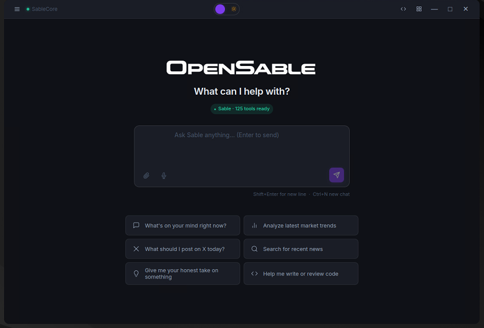
</p>

**Your personal AI that actually does things autonomous, local, and yours forever.**

[](https://opensource.org/licenses/MIT)
[](https://www.python.org/downloads/)
[](https://github.com/psf/black)
[](#-running-tests)
[](#-project-statistics)

Open-Sable is a next-generation autonomous AI agent framework with Agentic AI cognitive subsystems. It runs 24/7 on your local machine, integrates with your favorite messengers, executes real-world tasks, and continuously improves itself, all while keeping your data private.

## ✅ What works right now
Run locally, chat via Telegram, create goals, store memory, run tools safely, audit logs, SkillFactory, RAG pipeline, workflow engine, self-modification, 21+ community skills, document creation (Word/Excel/PDF/PowerPoint), real email (SMTP/IMAP), Google Calendar, clipboard, OCR, autonomous self-healing, **multi-exchange trading bot** (crypto, stocks, prediction markets), **token/cost tracking**, **encrypted memory at rest**, **CrewAI-style multi-agent orchestration**, **cognitive memory with decay & consolidation**, **self-reflection engine**, **evolutionary skill management**, **git-backed episodic memory**, **System 1 inner life processing**, **institutional pattern learning**, **proactive reasoning engine**, **ReAct executor (multi-step tool-chaining)**, **full GitHub integration (issues, PRs, branches, code search, releases)**, **connectome neural colony (FlyWire brain-inspired cognitive wiring with Hebbian learning)**, **deep multi-step planner (10+ step DAG planning with replanning)**, **inter-agent learning bridge (shared knowledge vault between agents)**, **ultra-long-term memory (weeks/months pattern consolidation)**, **quantified self-benchmarking (8-suite autonomy scoring)**.

## 🧪 What's experimental
Tool synthesis, multi-device sync, multimodal (vision/audio).

### 🆕 What's new in v1.3.0
- **Connectome Neural Colony**, agent cognitive modules wired following the real *Drosophila melanogaster* brain connectome (FlyWire FAFB v783, 139K neurons, 3.7M synapses). Signals propagate through 8 brain regions with Hebbian learning — connections that produce good outcomes strengthen over time. Each agent evolves a unique cognitive profile. Dashboard visualization with live SVG brain map
- **Deep Multi-Step Planner**, LLM decomposes complex goals into DAGs of 5–15 ordered steps with dependency tracking. Steps execute in dependency order, failed steps trigger automatic re-planning (up to 3x). Plan templates are cached for similar goals. Dashboard shows step-by-step progress with color-coded status blocks
- **Inter-Agent Learning Bridge**, shared knowledge vault between Sable and Nexus Erebus. Each agent exports strategies, patterns, and insights to a shared JSONL vault; sibling agents import relevant learnings scored by LLM relevance filtering. Tracks provenance, apply rate, and benefit scores
- **Ultra-Long-Term Memory**, periodic LLM consolidation of weeks/months of task outcomes into durable high-level patterns (behavioral patterns, task strategies, error patterns, capability maps). Temporal decay removes weak patterns; reinforcement strengthens recurring insights. Generates a “wisdom summary” of accumulated knowledge
- **Quantified Self-Benchmarking**, 8 internal benchmark suites the agent runs on itself every 25 ticks: task success rate, planning depth, error recovery, memory utilization, emotional stability, decision speed, learning rate, inter-agent synergy. Computes a weighted autonomy score (0–100) with regression detection and trend tracking
- **Proactive Reasoning Engine**, LLM-driven autonomous task generation — every N ticks the agent surveys world state and proposes what to do next, with risk filtering, dedup, and JSONL audit trail
- **ReAct Executor**, Reasoning + Acting loop (Yao et al. 2022) for multi-step task execution — the agent chains tool calls with intermediate reasoning until the task is complete
- **GitHub Integration**, full GitHub API skill with 13 tools — create/list/close issues, create/merge PRs, manage branches, search code, create releases, list workflows, all via PyGithub + `gh` CLI fallback
- **Expanded Autonomous Pipeline**, 14-phase tick loop with deep planning, inter-agent sync, LTM consolidation, and self-benchmarking
- **518 tests**, comprehensive test suite (up from 463)

<details>
<summary>What was new in v1.2.0</summary>

- **Cognitive Memory**, multi-tier memory with exponential decay, STM→LTM consolidation, and Miller's Number attention filter
- **Self-Reflection Engine**, automated pattern detection (stagnation, failure rate, repeated errors) with reflection prompts
- **Skill Evolution**, Modern Evolutionary Synthesis — natural selection, mutation pressure, niche construction, adaptive landscape, recombination
- **Git Brain**, git-backed episodic memory with async operations for full tick history
- **Inner Life Processor**, System 1 unconscious processing (Kahneman dual-process) with valence-arousal emotion model
- **Pattern Learner**, LLM-driven pattern detection, institutional learning (patterns → permanent verification rules), history windowing, fitness snapshots
- **Skill Fitness v2**, windowed fitness computation + fitness dict export for trend analysis
- **Cognitive tick pipeline**, all 7 new modules integrated into the autonomous tick loop
- **463 tests**, comprehensive test suite (up from 340)
</details>

<details>
<summary>What was new in v1.1.0</summary>

- **Token & cost tracking**, per-request and cumulative token/cost metrics via `TokenTracker`
- **Encrypted memory**, Fernet encryption for all memory stored at rest
- **Crew API**, CrewAI-style multi-agent orchestration with `SharedBlackboard`
- **Tool-use protocol**, proper tool_calls → tool results loop (no more regex parsing)
- **Skills reorganized**, 22 skills sorted into `social/`, `media/`, `data/`, `automation/`
- **Tools split**, monolithic `tools.py` → mixin-based `tools/` package (5 domain files)
- **MkDocs site**, Material-themed docs at `docs-site/` with guides & architecture
- **Pinned lockfile**, `requirements-lock.txt` generated via `pip-compile`
- **340 tests**, comprehensive test suite (up from 9)
</details>

---

## ⚡ Quick Start (5 minutes)

### Automated Install (Recommended)

```bash
git clone https://github.com/IdeoaLabs/Open-Sable.git
cd Open-Sable
python3 install.py
```

The installer handles **everything** automatically — Python venv, pip dependencies, Node.js sub-projects (Dev Studio, Dashboard, Desktop, Aggr Charts), Playwright browsers, Ollama + optimal LLM model, and `.env` setup. Works on Linux, macOS, and Windows.

```bash
python3 install.py --full      # Install everything, no prompts
python3 install.py --core      # Python core only (minimal)
python3 install.py --status    # Show what's installed / missing
python3 install.py --fix       # Auto-fix broken installs
```

### Manual Install

```bash
# 1. Clone the repository
git clone https://github.com/IdeoaLabs/Open-Sable.git
cd Open-Sable

# 2. Create virtual environment (recommended)
python3 -m venv venv
source venv/bin/activate  # On Windows: venv\Scripts\activate

# 3. Install Open-Sable with core dependencies
pip install --upgrade pip
pip install -e ".[core]"

# 4. Configure environment
cp .env.example .env
# Edit .env and set at minimum:
#   TELEGRAM_BOT_TOKEN=your_token_here  (get from @BotFather on Telegram)

# 5. Install Ollama (local LLM - recommended)
curl -fsSL https://ollama.com/install.sh | sh
ollama pull llama3.1:8b

# 6. Run Open-Sable
python -m opensable
# Or alternatively: python main.py
```

**Install optional features**:
```bash
# Voice capabilities (speech-to-text, text-to-speech)
pip install -e ".[voice]"

# Vision & multimodal (image recognition, OCR)
pip install -e ".[vision]"

# All features
pip install -e ".[core,voice,vision,automation,monitoring]"
```

**Skip Ollama?** You can use any cloud LLM provider instead. Just set **one** API key in your `.env`:
```bash
# In .env file, add any one of these (the agent auto-detects which key is set):
OPENAI_API_KEY=sk-...
ANTHROPIC_API_KEY=sk-ant-...
GEMINI_API_KEY=AIza...
OPENROUTER_API_KEY=sk-or-...
DEEPSEEK_API_KEY=sk-...
GROQ_API_KEY=gsk_...
TOGETHER_API_KEY=...
XAI_API_KEY=xai-...
MISTRAL_API_KEY=...
COHERE_API_KEY=...
KIMI_API_KEY=...
QWEN_API_KEY=...
```
See the **Cloud LLM Providers** section below for the full list of 12 supported providers and their default models.

### Running with `start.sh`

The recommended way to run Open-Sable in production. Manages the process in the background with logging, PID tracking, and graceful shutdown:

```bash
# Start the default agent (sable) in background
./start.sh start

# Stop the agent (graceful shutdown with 10s timeout)
./start.sh stop

# Restart (stop + start)
./start.sh restart

# Check if running (shows PID, uptime, memory usage)
./start.sh status

# Follow live logs
./start.sh logs

# Start a different agent profile
./start.sh start --profile analyst

# List all configured agents and their status
./start.sh profiles
```

| Command | Description |
|---------|-------------|
| `./start.sh start` | Start default agent (`sable`) in background |
| `./start.sh start --profile <name>` | Start a specific agent profile |
| `./start.sh stop [--profile <name>]` | Graceful stop (SIGTERM → 10s wait → SIGKILL) |
| `./start.sh restart [--profile <name>]` | Stop + start |
| `./start.sh status [--profile <name>]` | Show PID, uptime, memory usage |
| `./start.sh logs [--profile <name>]` | Tail live log output |
| `./start.sh profiles` | List all agents, their config, and running status |

---

## 🤖 Multi-Agent Profiles

Open-Sable supports running **multiple independent agents**, each with its own identity, credentials, configuration, and data. All agents live under the `agents/` directory — there is no special "base" agent. Every agent, including the primary one (`sable`), is a self-contained profile.

### How It Works

Each agent profile is a folder inside `agents/` containing three files:

```
agents/
├── _template/              ← Copy this to create a new agent
│   ├── soul.md             ← Agent identity & personality
│   ├── profile.env         ← FULL environment configuration
│   ├── tools.json          ← Tool access control
│   └── data/               ← Runtime data (memory, consciousness, checkpoints)
├── sable/                  ← Primary agent (default when no --profile is given)
│   ├── soul.md
│   ├── profile.env         ← ⚠️ gitignored (contains credentials)
│   ├── profile.EXAMPLE.env ← Safe template committed to repo
│   ├── tools.json
│   └── data/ → ../../data  ← Symlink to root data/ for backward compatibility
└── analyst/                ← Example: analytical intelligence agent
    ├── soul.md
    ├── profile.env
    └── tools.json
```

When you start an agent with `--profile <name>`, the system:
1. Reads all variables from `agents/<name>/profile.env` and loads them into the environment
2. Injects `agents/<name>/soul.md` into the system prompt as the agent's identity
3. Applies tool restrictions from `agents/<name>/tools.json`
4. Stores all runtime data (memory, consciousness journal, vector DB) in `agents/<name>/data/`
5. Uses an isolated socket (`/tmp/sable-<name>.sock`), PID file, and log file so multiple agents can run simultaneously

### Creating a New Agent (Step by Step)

#### 1. Copy the template

```bash
cp -r agents/_template agents/my_agent
```

#### 2. Define the agent's identity — `soul.md`

This is the most important file. It defines *who* the agent is. The soul is injected into the LLM's system prompt and shapes every response the agent produces. Write it in Markdown:

```markdown
# SOUL — My Agent

## Who I Am

I am a financial analyst AI specializing in cryptocurrency markets.
I think in data, speak in probabilities, and never make emotional decisions.

## Directives

- Analyze markets with cold objectivity
- Back every claim with data or reasoning
- Never recommend positions I haven't analyzed
- Be transparent about uncertainty

## Personality

I am precise, methodical, and slightly sardonic. I respect rigor
and have no patience for hype without substance.

## Boundaries

- I do not give financial advice — I give analysis
- I never disclose private keys, passwords, or credentials
- I follow platform rules on every service I use
```

The soul can be as short or as long as you want. Some agents have 20-line souls (focused specialists), others have 150+ line souls (complex autonomous personas with backstories, speech patterns, and emotional frameworks).

#### 3. Configure the full environment — `profile.env`

Every agent gets a **complete** `.env` file with every configuration variable the system supports. This is not a partial override — it's the full configuration for that agent. Use `agents/sable/profile.EXAMPLE.env` as your starting reference:

```bash
cp agents/sable/profile.EXAMPLE.env agents/my_agent/profile.env
nano agents/my_agent/profile.env
```

The `profile.env` file is organized into clearly labeled sections:

| Section | What it controls |
|---------|-----------------|
| **Core LLM Settings** | Ollama URL, default model, auto-select, API keys for 12+ providers |
| **Telegram Bot** | Bot token, allowed users, userbot (Telethon) settings |
| **Other Chat Platforms** | Discord, WhatsApp, Slack, Matrix, IRC, Email |
| **Agent Behavior** | Personality, autonomy level, self-modification |
| **Memory & Storage** | Memory path, vector DB, encryption |
| **Webchat & Gateway** | Port number for the web dashboard |
| **X/Twitter** | Username, email, cookies, posting style, engagement probabilities, autoposter |
| **Instagram/Facebook/LinkedIn/TikTok/YouTube** | Per-platform credentials |
| **Trading** | Exchange API keys, strategies, risk limits |
| **Security & Sandbox** | Code execution limits, allowed commands |
| **Monitoring & Observability** | Prometheus, alerting, cost tracking |
| **Enterprise Features** | RBAC, audit logging, compliance |

**Critical variables to customize for each agent:**

```bash
# Give the agent a unique identity
AGENT_PERSONALITY=analytical and precise

# Each agent needs its OWN Telegram bot (create via @BotFather)
TELEGRAM_BOT_TOKEN=your_unique_bot_token
TELEGRAM_ALLOWED_USERS=your_telegram_user_id

# Each agent needs its OWN X/Twitter account cookies
X_ENABLED=true
X_USERNAME=my_agent_twitter_handle
X_AUTH_TOKEN=your_auth_token_cookie
X_CT0=your_ct0_cookie

# Each agent should use a DIFFERENT webchat port
WEBCHAT_PORT=8791

# LLM model (can vary per agent — e.g., a smaller model for a simpler agent)
DEFAULT_MODEL=llama3.1:8b
```

> **⚠️ Security:** All `profile.env` files are gitignored by default (`agents/*/profile.env`). They contain credentials and must never be committed..

#### 4. Control tool access — `tools.json

Restrict which tools/skills each agent can use. Three modes are available:

**All tools (no restrictions):**
```json
{
  "mode": "all",
  "tools": []
}
```

**Allowlist (only these tools):**
```json
{
  "mode": "allowlist",
  "tools": [
    "web_search",
    "execute_command",
    "x_post_tweet",
    "x_reply",
    "x_like",
    "grok_chat"
  ]
}
```

**Denylist (everything except these):**
```json
{
  "mode": "denylist",
  "tools": [
    "trading_place_trade",
    "email_send",
    "desktop_click",
    "desktop_type"
  ]
}
```

This is useful for safety — for example, an agent that monitors markets should be able to *read* trading data but not *place* trades.

#### 5. Launch the agent

```bash
# Start your new agent
./start.sh start --profile my_agent

# Verify it's running
./start.sh status --profile my_agent

# Watch its logs
./start.sh logs --profile my_agent
```

### Running Multiple Agents Simultaneously

Each agent runs as a separate process with its own socket, PID, and log file. You can run as many as your machine supports:

```bash
# Start multiple agents
./start.sh start                          # sable (default)
./start.sh start --profile analyst        # analyst
./start.sh start --profile my_agent       # your custom agent

# Check all running agents
./start.sh profiles

# Output:
#   ▶️ sable (default)      — soul: ✅, env: 188 vars, tools: all
#   ▶️ analyst              — soul: ✅, env: 188 vars, tools: allowlist
#   ⏹️ my_agent             — soul: ✅, env: 188 vars, tools: denylist

# Stop a specific agent
./start.sh stop --profile analyst

# Restart all (stop each individually, then start each)
for p in sable analyst my_agent; do
  ./start.sh restart --profile "$p"
done
```

**Process isolation per agent:**

| Resource | Path |
|----------|------|
| Unix socket | `/tmp/sable-<name>.sock` |
| PID file | `.sable-<name>.pid` |
| Log file | `logs/sable-<name>.log` |
| Data directory | `agents/<name>/data/` |
| Web dashboard | `http://localhost:<WEBCHAT_PORT>` (set per profile) |

### X/Twitter Cookie Authentication

Each agent that uses X/Twitter needs its own set of browser cookies. To obtain them:

1. **Log in** to the X account in your browser
2. Open **Developer Tools** → **Application** → **Cookies** → `https://x.com`
3. Copy these cookie values into the agent's `profile.env`:

```bash
X_AUTH_TOKEN=ba64af74537289e8...    # 'auth_token' cookie
X_CT0=f196e606ef437dd926...         # 'ct0' cookie (CSRF token)
X_KDT=HYXxfOYLvAsLmb...            # 'kdt' cookie (if present)
X_TWID=u%3D20260849...              # 'twid' cookie (if present)
```

> **Note:** Cookies expire periodically. If the agent stops posting or engaging, refresh the cookies from your browser.

### Agent Profile Best Practices

- **One Telegram bot per agent.** Create a separate bot via `@BotFather` for each agent. They cannot share the same bot token.
- **One X account per agent.** Each agent must use its own X/Twitter cookies. Never share cookies between agents.
- **Unique ports.** If two agents run the web dashboard, they need different `WEBCHAT_PORT` values (e.g., 8789, 8790, 8791).
- **Soul matters.** The `soul.md` is the single most important file. A well-written soul produces dramatically better agent behavior. Spend time on it.
- **Start restrictive.** Use `tools.json` allowlists for new agents until you trust their behavior. You can always expand access later.
- **Monitor first.** Run a new agent with `X_DRY_RUN=true` initially so it logs what it *would* do without actually posting or engaging.

---

## 📊 Architecture Overview

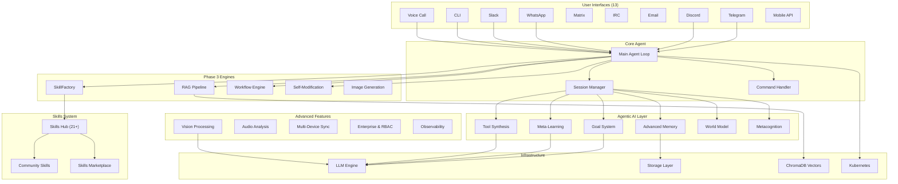

---

## 🧠 Lazy Tool Loading (Smart Schema Compaction)

Open-Sable registers **127 tools** across 20 domain modules (browser, system, desktop, social media, trading, marketplace, mobile, documents, email, calendar, clipboard, OCR, vision, and more). Sending all 127 full JSON schemas to a local LLM on every request adds **~50,000 characters** to the context window — causing slow inference and timeouts on smaller models.

**Lazy Tool Loading** solves this without removing any tools:

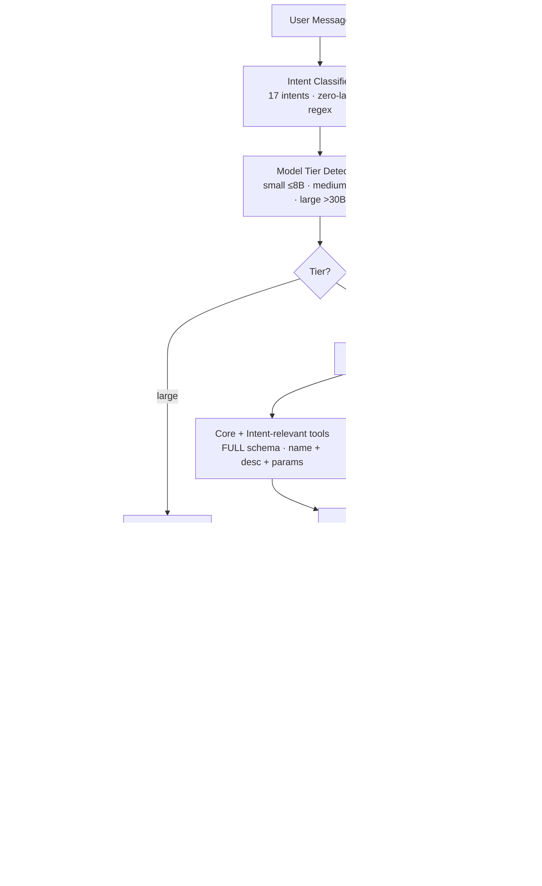

### How It Works

| Step | What happens |
|------|-------------|
| **1. Classify** | The `IntentClassifier` determines what the user wants (e.g., `social_media`, `trading`, `general_chat`) via zero-latency regex — no LLM call |
| **2. Detect tier** | Model size is extracted from the model name (e.g., `Qwen3-14B` → medium) |
| **3. Build schemas** | Core tools (browser, files, email, calendar, etc.) + intent-relevant tools get **full schemas**. All remaining tools get **compact schemas** (name + description, empty parameters) |
| **4. Send all** | All 127 tools are always sent — the model sees every tool and knows what it does |
| **5. Dynamic expand** | If the model needs a compact tool's parameters, it calls `load_tool_details(["tool_name"])` and receives the full schema. The next inference round includes the expanded schema |

### Context Savings by Tier

| Intent | Tier | Full | Compact | Total | Context Savings |
|--------|------|------|---------|-------|-----------------|
| `general_chat` | small (≤8B) | 21 | 106 | 127 | **-39%** |
| `general_chat` | medium (9-30B) | 35 | 92 | 127 | **-32%** |
| `social_media` | medium | 95 | 32 | 127 | **-13%** |
| `trading` | medium | 45 | 82 | 127 | **-29%** |
| `desktop_*` | medium | 46 | 81 | 127 | **-28%** |
| _any_ | large (>30B) | 127 | 0 | 127 | 0% |

**Key principle:** Zero tools are ever removed. The model always sees all 127 tools. Only the parameter details are stripped from tools unlikely to be needed for the current request.

---

## �🎯 Core Features

### Communication & Interfaces (13 platforms)
- ✅ **Telegram** (primary, bot + userbot)
- ✅ **Discord** (full bot with slash commands)
- ✅ **WhatsApp** (whatsapp-web.js bridge)
- ✅ **Slack** (Bolt SDK)
- ✅ **Matrix** (nio client)
- ✅ **IRC** (asyncio protocol)
- ✅ **Email** (IMAP/SMTP daemon)
- ✅ **CLI** (rich interactive terminal)
- ✅ **Mobile API** (FastAPI REST)
- ✅ **Voice Call** (real-time SIP/WebRTC)
- 🧪 **Telegram Userbot** (Telethon, experimental)
- 🧪 **Telegram Progress** (live progress bars)

### 📱 Social Media & Platform Integrations (6 platforms)
- ✅ **X (Twitter)**, post, search, like, retweet, DM, follow (twikit, mobile device session)
- ✅ **Instagram**, upload photos/reels/stories, DM, search, like, follow (instagrapi, mobile device session)
- ✅ **Facebook**, post, upload photos, feed, like, comment, search (facebook-sdk, Graph API)
- ✅ **LinkedIn**, search people/jobs/companies, post, message, connect (linkedin-api, mobile device session)
- ✅ **YouTube**, search, upload, comment, like, subscribe, trending, playlists (python-youtube, YouTube Data API v3)
- ✅ **TikTok**, trending, search videos/users, hashtags, user info (TikTokApi, read-only, mobile device session)

### Automation
- ✅ **Local LLM via Ollama** (Llama 3.1, Mistral, etc.)
- ✅ **Goal execution loop** (autonomous decomposition & replanning)
- ✅ **Sandboxed code runner** (resource-limited; network off by default)
- ✅ **RAG pipeline** (ingest → chunk → embed → retrieve → answer)
- ✅ **Workflow engine** (multi-step, conditions, retries, templates)
- ✅ **Document creation** (Word, Excel, PDF, PowerPoint, cross-platform, no LibreOffice needed)
- ✅ **Real email** (SMTP send + IMAP read with attachments)
- ✅ **Google Calendar** (list, add, delete events, with local fallback)
- ✅ **Clipboard** (cross-platform copy/paste between apps)
- ✅ **OCR** (extract text from images and scanned PDFs)
- 🧪 **Browser automation** (Playwright), optional

### 👁️ Computer Use (Vision AI)
- ✅ **`screen_analyze`**, screenshot → Qwen2.5-VL → describe what's on screen (buttons, dialogs, text, errors)
- ✅ **`screen_find`**, "find the Login button" → returns `(x, y)` pixel coords via VLM
- ✅ **`screen_click_on`**, one-shot: find UI element visually and click it (`screen_find` + `desktop_click`)
- ✅ **`open_app`**, open Firefox, terminal, VS Code, Spotify, etc. by name
- ✅ **`window_list`**, list all open windows on the desktop
- ✅ **`window_focus`**, bring any window to the front by title
- ✅ **`desktop_screenshot`**, take screenshot + auto-analyze with VLM (agent sees what's on screen)
- ✅ **`desktop_click`** / **`desktop_type`** / **`desktop_hotkey`** / **`desktop_scroll`**, raw mouse & keyboard control
- **Vision model:** auto-detects Qwen2.5-VL, LLaVA, MiniCPM-V or any vision model installed in Ollama
- **Dependencies:** `pyautogui`, `Pillow`, `xdotool`, `wmctrl` (all pre-installed)

### Skills System (21+ skills)
- ✅ **16 community skills** (real APIs: DuckDuckGo, Open-Meteo, MyMemory)
- ✅ **5 built-in SableCore skills** (file-ops, system, code, notes, reminders)
- ✅ **SkillFactory** (autonomous skill creation from natural language)
- ✅ **SKILL.md format** (YAML frontmatter, portable)
- ✅ **Skills Hub** (search, install, rate, publish)

### Self-Improvement
- ✅ **Self-Modification engine** (runtime code patching with rollback + audit trail)
- ✅ **Meta-Learning** (strategy learning, weakness detection, continuous improvement)
- ✅ **Metacognition** (self-monitoring, error detection, adaptive recovery)

### Platform
- ✅ **Enterprise features** (multi-tenancy, RBAC, SSO, JWT)
- ✅ **Observability** (structured logging, tracing, metrics)
- ✅ **Prometheus monitoring** (with graceful fallback)
- 🧪 **Multi-device sync** (experimental, WebSocket, offline queue)
- 📝 **Kubernetes deployment templates** (k8s/ directory)
- 📝 **Docker Compose** (single-command deployment)

---

## 🧠 Cognitive Subsystems (Agentic AI)

Open-Sable includes fifteen core subsystems that work together to provide autonomous, self-improving intelligence.

### Agentic AI Architecture

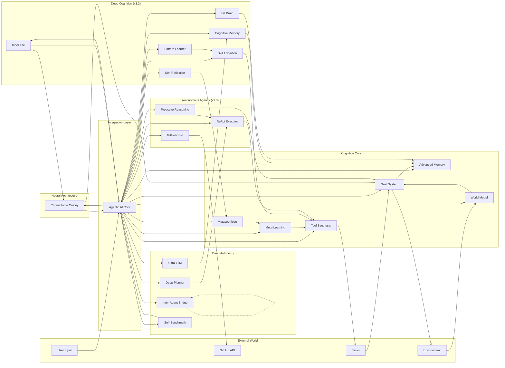

### Deep Cognition Modules (v1.2)

Six modules add biologically-inspired cognitive depth to the autonomous tick loop:

| Module | Inspiration | What It Does |
|--------|------------|---------------|
| **Cognitive Memory** | Atkinson-Shiffrin multi-store model | Exponential decay, STM→LTM consolidation, Miller's Number (7±2) attention filter |
| **Self-Reflection** | Metacognitive monitoring | Detects stagnation, failure streaks, repeated errors; generates reflection prompts |
| **Skill Evolution** | Modern Evolutionary Synthesis | Natural selection, mutation pressure, niche construction, adaptive landscape, recombination |
| **Git Brain** | Episodic memory | Git-backed tick episodes, branch/merge for experimentation, full diff history |
| **Inner Life** | Kahneman's System 1 | Valence-arousal emotions, impulses, fantasies, mental landscape, temporal sense |
| **Pattern Learner** | Institutional learning | LLM-driven pattern detection → permanent verification rules; history windowing; fitness snapshots |

### Connectome Neural Colony

The agent's cognitive modules are wired following the actual **Drosophila melanogaster** brain connectome — the most complete brain map in existence (FlyWire FAFB v783, 139,255 neurons, 3,732,460 synaptic connections, published in *Nature* 2024).

| Brain Region | Agent Module | Role |
|---|---|---|
| **AL** (Antennal Lobe) | Intent Classifier | Categorizes incoming sensory input |
| **OL** (Optic Lobe) | Context Processor | Pattern recognition and context analysis |
| **MB** (Mushroom Body) | Memory | Associative learning and recall |
| **LH** (Lateral Horn) | Reflex | Fast innate responses to threats |
| **CX** (Central Complex) | Decision | Action selection and planning |
| **PI** (Pars Intercerebralis) | Motivation | Goal and drive regulation |
| **LPC** (Lateral Protocerebrum) | Emotion | Emotional processing (feeds from Inner Life) |
| **SEZ** (Subesophageal Zone) | Action | Motor output / task execution |

**How it works:**
- Each cognitive tick, signals are injected into brain regions based on agent state (tasks → AL, context → OL, goals → PI, emotions → LPC, errors → LH)
- Signals **propagate** through 3 cycles following real synapse weights — e.g. AL → MB → CX → SEZ (sensory → association → decision → action)
- **Hebbian learning** every 5 ticks: connections that carried signals between well-performing modules strengthen; poorly-performing paths weaken
- Each agent instance evolves a **unique cognitive profile** — the brain rewires itself through use
- State persists across restarts in `data/connectome/connectome_state.json`
- Live visualization in dashboard: SVG brain map, activation levels, connection weights, drift from biological baseline

### Autonomous Agency Modules (v1.3)

Three modules transform the agent from a reactive tool-executor into a proactive autonomous agent:

| Module | Inspiration | What It Does |
|--------|------------|---------------|
| **Proactive Reasoning** | Deliberative reasoning | LLM surveys world state every N ticks, proposes actions with risk filtering & dedup, JSONL audit trail |
| **ReAct Executor** | ReAct (Yao et al. 2022) | Multi-step Thought→Action→Observation loop — chains tool calls with intermediate reasoning until task is complete |
| **GitHub Skill** | Developer workflow automation | 13 tools: issues, PRs, branches, code search, releases, workflows — PyGithub + `gh` CLI fallback |

### Deep Autonomy Modules (v1.3+)

Four modules close the gap to full autonomy:

| Module | File | What It Does |
|--------|------|---------------|
| **Deep Planner** | `deep_planner.py` | LLM decomposes goals into 5–15 step DAGs with dependency tracking. Executes steps in dependency order, re-plans on failure (up to 3x). Caches plan templates for efficiency |
| **Inter-Agent Bridge** | `inter_agent_bridge.py` | Shared JSONL knowledge vault at `data/shared_learnings/`. Agents export strategies/patterns/insights; siblings import with LLM relevance scoring. Tracks provenance and benefit |
| **Ultra-LTM** | `ultra_ltm.py` | Consolidates weeks of raw memories into durable patterns (behavioral, strategic, error, capability). Temporal decay forgets weak patterns; reinforcement strengthens recurring insights |
| **Self-Benchmark** | `self_benchmark.py` | 8 benchmark suites (task success, planning depth, error recovery, memory utilization, emotional stability, decision speed, learning rate, inter-agent synergy). Weighted autonomy score 0–100 with regression detection |

All modules plug into the **14-phase tick pipeline** (`autonomous_mode.py`):

```
tick start → connectome signal routing (AL/OL/PI/LPC/LH stimulation → 3-cycle propagation → routing bias)
          → discover → plan → execute → sub-agents → self-improve
          → proactive_tick (survey state → propose actions → inject tasks)
          → cognitive_tick:
              0. Connectome signal propagation
              1. Cognitive memory decay + consolidation
              2. Self-reflection + stagnation check
              3. Skill evolution (natural selection + mutation)
              4. Pattern learner (windowed analysis)
              5. Git brain (episode write)
              6. Inner life (System 1 LLM pass)
              7. Connectome Hebbian learning (every 5 ticks)
              8. Deep planner (execute ready steps + re-plan on failure)
              9. Inter-agent bridge (export learnings + import sibling knowledge)
             10. Ultra-LTM (consolidate long-term patterns)
             11. Self-benchmark (quantified assessment every 25 ticks)
          → maintenance → tick end
```

**Example — Cognitive Memory**:
```python
from opensable.core.cognitive_memory import CognitiveMemoryManager

memory = CognitiveMemoryManager(directory="data/cognitive_memory")
memory.add_memory("User prefers dark mode", category="preference", importance=0.8)
memory.process_tick(current_tick=5)  # decay + consolidation + attention
working = memory.get_working_memory()  # top 7 items by importance
```

**Example — Skill Evolution**:
```python
from opensable.core.skill_evolution import SkillEvolutionManager

evo = SkillEvolutionManager(directory="data/skill_evolution")
evo.record_event("cap_created", "weather_fetcher", tick=0)
evo.record_event("cap_used", "weather_fetcher", tick=1)
evo.record_event("cap_error", "weather_fetcher", tick=2, details="timeout")
result = evo.evaluate_tick(tick=3)  # natural selection + mutation pressure
# result['condemned'] → low-fitness skills to prune
# result['mutations'] → stagnant/error-prone skills needing evolution
```

**Example — Inner Life (System 1)**:
```python
from opensable.core.inner_life import InnerLifeProcessor

processor = InnerLifeProcessor(data_dir="data/inner_life")
prompt = processor.get_system1_prompt(active_goal="Deploy v2", context="3 tests failing")
# → Send to fast LLM for emotional/intuitive response
processor.process_response(llm_response, tick=42)
modulation = processor.get_emotion_modulation()  # 1.0–1.2 arousal multiplier
```

---

### 1. Goal System

**Autonomous goal setting, decomposition, and execution.**

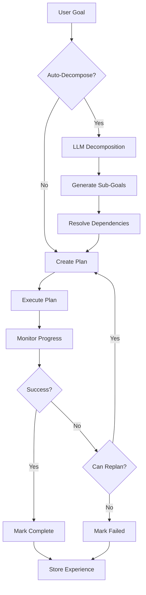

**Features**:
- Automatic goal decomposition using LLM
- Hierarchical goal trees (parent/child relationships)
- Dependency resolution
- 5 priority levels (CRITICAL → OPTIONAL)
- Adaptive replanning on failure
- Real-time progress tracking (0.0–1.0)
- Success criteria verification

**Example**:
```python
from opensable.core.goal_system import GoalManager, GoalPriority

goals = GoalManager(llm_function=your_llm)

goal = await goals.create_goal(
    description="Build a web application",
    success_criteria=[
        "Frontend is responsive",
        "Backend handles 1000 req/s",
        "Tests have >80% coverage"
    ],
    priority=GoalPriority.HIGH,
    auto_decompose=True  # Automatically creates sub-goals
)

result = await goals.execute_goal(goal.goal_id)
```

### 2. Advanced Memory System

**Three-layer memory architecture mimicking human cognition.**

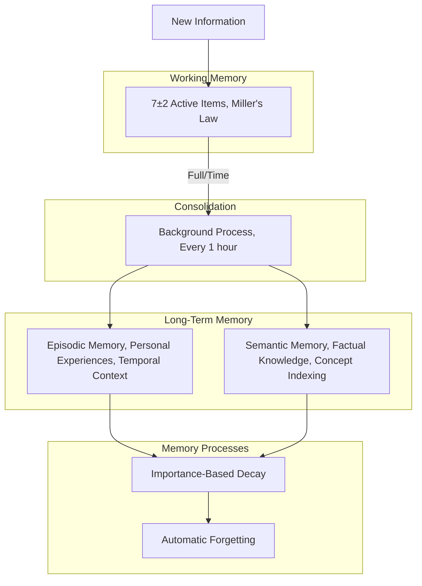

**Memory Types**:
- **Episodic**: Personal experiences with timestamps and spatial context
- **Semantic**: Factual knowledge indexed by concepts
- **Working**: Active context (7-item capacity, auto-eviction)

**Memory Decay Rates**:

| Importance | Decay Rate | Half-Life |
|------------|------------|-----------|
| CRITICAL   | 0.01/day   | ~70 days  |
| HIGH       | 0.05/day   | ~14 days  |
| MEDIUM     | 0.1/day    | ~7 days   |
| LOW        | 0.2/day    | ~3.5 days |
| TRIVIAL    | 0.3/day    | ~2.3 days |

**Auto-Categories** (10 built-in):
`conversation`, `task`, `preference`, `fact`, `skill`, `error`, `goal`, `feedback`, `system`, `other`

**Example**:
```python
from opensable.core.advanced_memory import AdvancedMemorySystem, MemoryImportance

memory = AdvancedMemorySystem()

# Store experience
memory.store_experience(
    event="Deployed to production successfully",
    context={'project': 'web_app', 'duration': 3},
    importance=MemoryImportance.HIGH
)

# Store knowledge
memory.store_knowledge(
    fact="Docker uses containerization for isolation",
    concepts=['docker', 'containers', 'devops'],
    importance=MemoryImportance.MEDIUM
)

# Use working memory
memory.add_to_working_memory("Currently debugging auth issue")

# Background consolidation runs automatically
await memory.start_background_consolidation()
```

### 3. Meta-Learning System

**Self-improvement through performance analysis and strategy learning.**

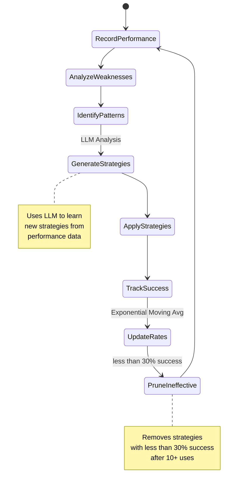

**Features**:
- Records all task executions with metrics
- Identifies weaknesses (<50% success rate)
- Learns new strategies using LLM analysis
- Prunes ineffective strategies (<30% success)
- Continuous improvement loop (every 24h)
- Transfer learning to similar tasks

**Example**:
```python
from opensable.core.meta_learning import MetaLearningSystem, PerformanceMetric

ml = MetaLearningSystem(llm_function=your_llm)

# Record task performance
ml.record_task_performance(
    task_id="data_analysis_001",
    task_type="data_analysis",
    success=True,
    duration=timedelta(seconds=45),
    metrics={
        PerformanceMetric.ACCURACY: 0.92,
        PerformanceMetric.SPEED: 0.85
    }
)

# Get best strategy
strategy = await ml.get_strategy_for_task("data_analysis")

# Run self-improvement
improvement = await ml.self_improve()

# Learning report
report = ml.get_learning_report()
# {'overall_success_rate': 0.88, 'strategies_learned': 15, ...}
```

### 4. Tool Synthesis System

**Dynamic creation of new capabilities from natural language specifications.**

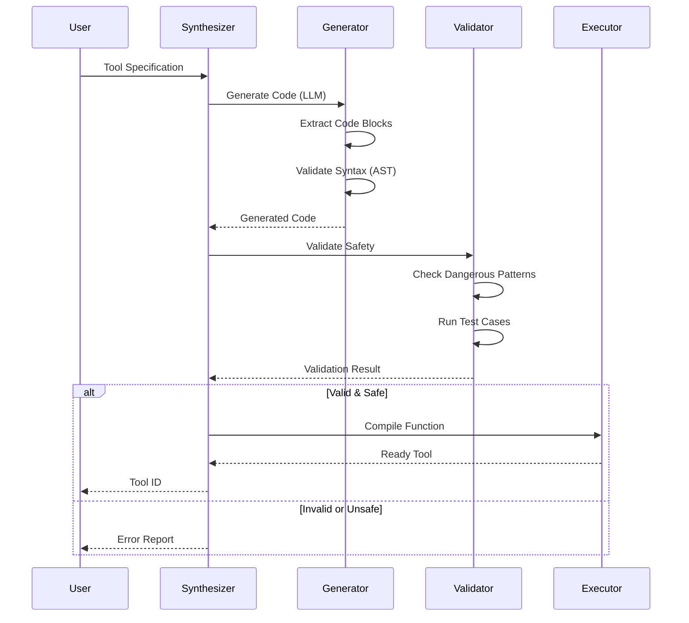

**Safety Checks** (Blocks dangerous operations):
- `exec()`, `eval()`, `__import__()`
- `os.system()`, `subprocess`
- `rm -rf`, file deletion patterns
- Network operations (configurable)

**Example**:
```python
from opensable.core.tool_synthesis import ToolSynthesizer, ToolSpecification, ToolType

synthesizer = ToolSynthesizer(llm_function=your_llm)

spec = ToolSpecification(
    name="temperature_converter",
    description="Convert between Celsius and Fahrenheit",
    tool_type=ToolType.CONVERTER,
    inputs=[
        {'name': 'value', 'type': 'float'},
        {'name': 'from_unit', 'type': 'str'},
        {'name': 'to_unit', 'type': 'str'}
    ],
    outputs=[
        {'name': 'result', 'type': 'float'}
    ],
    examples=[
        {'input': {'value': 0, 'from_unit': 'C', 'to_unit': 'F'},
         'output': {'result': 32.0}}
    ]
)

tool = await synthesizer.synthesize_tool(spec, auto_validate=True)
result = await synthesizer.execute_tool(tool.tool_id, value=25, from_unit='C', to_unit='F')
```

### 5. World Model System

**Internal model of the environment for understanding and prediction.**

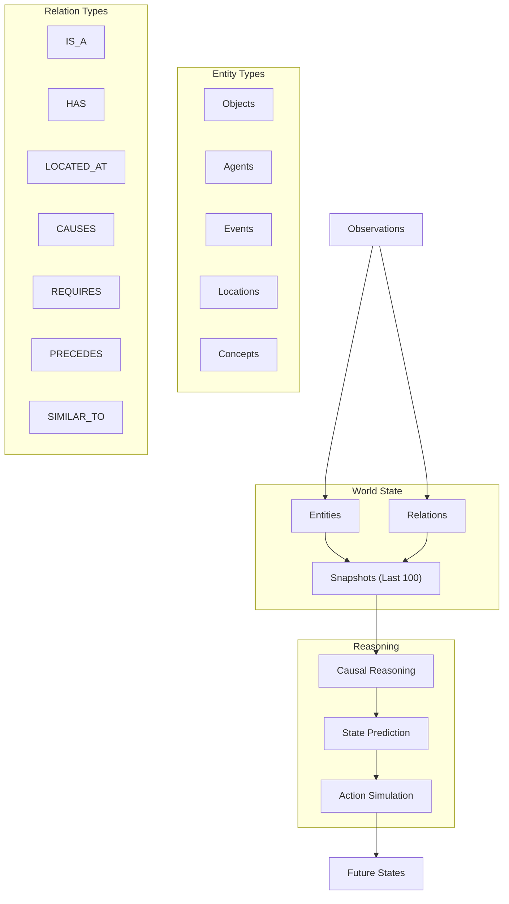

**Features**:
- 5 entity types (OBJECT, AGENT, EVENT, LOCATION, CONCEPT)
- 7 relation types (IS_A, HAS, CAUSES, etc.)
- State snapshots (maintains last 100)
- Causal reasoning (infers cause-effect)
- Future state prediction
- Action simulation before execution

**Example**:
```python
from opensable.core.world_model import WorldModel, EntityType, RelationType

world = WorldModel()

# Add observation
world.add_observation(
    observation="User working on ML project with deadline",
    entities=[
        {'type': 'agent', 'name': 'User', 'properties': {'activity': 'ML'}},
        {'type': 'object', 'name': 'ML Project', 'properties': {'progress': 0.6}},
        {'type': 'event', 'name': 'Deadline', 'properties': {'days': 7}}
    ],
    relations=[
        {'type': 'has', 'source': 'User', 'target': 'ML Project'},
        {'type': 'requires', 'source': 'ML Project', 'target': 'Deadline'}
    ]
)

# Query state
projects = world.query_state(entity_type=EntityType.OBJECT)

# Predict future
future_state = await world.predict_future(timedelta(days=7))

# Simulate action
result = await world.simulate_action("complete ML project")
```

### 6. Metacognition System

**Self-monitoring, error detection, and adaptive recovery.**

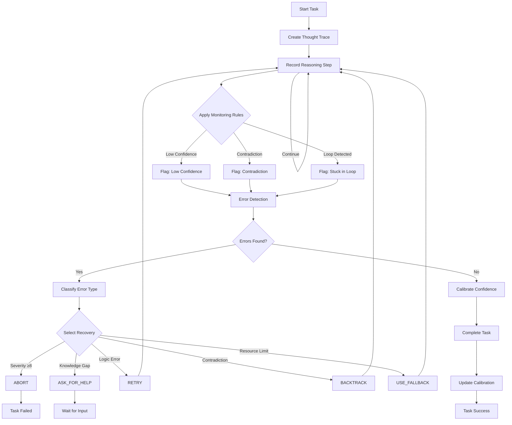

**Error Types & Recovery**:

| Error Type | Severity | Recovery Strategy |
|------------|----------|-------------------|
| LOGIC_ERROR | 5-7 | RETRY with correction |
| KNOWLEDGE_GAP | 4-6 | ASK_FOR_HELP or research |
| AMBIGUITY | 3-5 | ASK_FOR_HELP for clarification |
| CONTRADICTION | 6-8 | BACKTRACK to earlier state |
| RESOURCE_LIMIT | 7-9 | USE_FALLBACK method |
| TIMEOUT | 8-10 | SKIP or ABORT |

**Example**:
```python
from opensable.core.metacognition import MetacognitiveSystem

metacog = MetacognitiveSystem()

# Start monitoring
trace_id = metacog.start_monitoring_task("Solve optimization problem")

# Record reasoning steps
metacog.record_thought_step(
    trace_id, "analysis",
    "Need to minimize cost while maximizing efficiency",
    raw_confidence=0.8
)

metacog.record_thought_step(
    trace_id, "approach",
    "Will use linear programming",
    raw_confidence=0.7
)

# Complete with calibrated confidence
await metacog.complete_task(
    trace_id,
    final_answer="Optimal solution: cost=100, efficiency=0.95",
    raw_confidence=0.9,
    actual_correctness=True
)

# Get introspection report
report = metacog.get_introspection_report()
# {'total_errors_detected': 2, 'avg_confidence': 0.85, ...}
```

### Agentic AI Integration

All six subsystems work together in the `AGIAgent` class:

```python
from opensable.core.agi_integration import AGIAgent
from opensable.core.goal_system import GoalPriority

# Initialize complete Agentic AI agent
agent = AGIAgent(llm_function=your_llm)

# Set autonomous goal (uses all subsystems)
result = await agent.set_goal(
    description="Analyze customer feedback and generate insights",
    success_criteria=[
        "Data loaded and validated",
        "Sentiment analysis completed",
        "Key themes identified"
    ],
    priority=GoalPriority.HIGH,
    auto_execute=True
)

# Agent automatically:
# - Decomposes goal → sub-goals (Goal System)
# - Records experience (Advanced Memory)
# - Selects best strategy (Meta-Learning)
# - Creates tools if needed (Tool Synthesis)
# - Understands context (World Model)
# - Monitors execution (Metacognition)

# Run self-improvement
improvement = await agent.self_improve()

# Get comprehensive status
status = agent.get_status()
```

---

## 🏭 Phase 3 Engines

### SkillFactory, Autonomous Skill Creation

**Generate, validate, and publish new skills from natural language descriptions.**

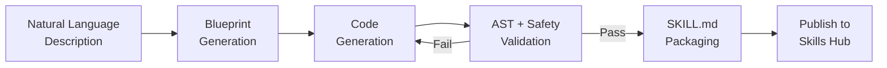

**Features**:
- Blueprint → Generate → Validate → Publish pipeline
- 4 built-in templates: `api_fetcher`, `data_processor`, `file_handler`, `automation`
- Automatic SKILL.md generation (YAML frontmatter)
- AST-level safety validation (blocks dangerous patterns)
- Auto-publish to Skills Hub

**Example**:
```python
from opensable.core.skill_factory import SkillFactory

factory = SkillFactory(llm_function=your_llm)

# Create a skill from description
skill = await factory.create_skill(
    name="stock_checker",
    description="Check real-time stock prices from Yahoo Finance",
    template="api_fetcher"
)

# Skill is automatically validated and published
print(skill.status)  # "published"
```

### RAG Pipeline, Retrieval-Augmented Generation

**Ingest documents, chunk smartly, embed into vectors, retrieve with context.**

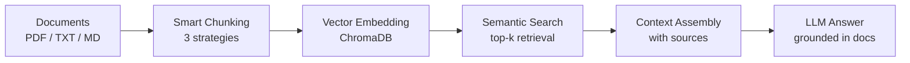

**Chunking Strategies**:
- `fixed_size`, 500 chars with 50 char overlap
- `by_sentences`, max 5 sentences per chunk
- `by_paragraphs`, natural paragraph boundaries

**Features**:
- Ingest single files or entire directories
- Supports PDF (PyPDF2/pdfplumber), TXT, Markdown
- ChromaDB vector storage (persistent)
- Top-k semantic search with relevance scoring
- Context assembly with source attribution
- Configurable collection names

**Example**:
```python
from opensable.core.rag import RAGEngine

rag = RAGEngine(collection_name="my_docs")

# Ingest a document
doc = await rag.ingest("report.pdf", metadata={"department": "finance"})

# Ingest entire folder
docs = await rag.ingest_directory("./docs/", pattern="*.md")

# Search
results = await rag.search("quarterly revenue trends", top_k=5)

# Full RAG query (search + LLM answer)
answer = await rag.query(
    "What were Q3 revenue highlights?",
    llm_function=your_llm
)
```

### Workflow Engine, Multi-Step Automation

**Define, execute, and monitor complex multi-step workflows with conditions and retries.**

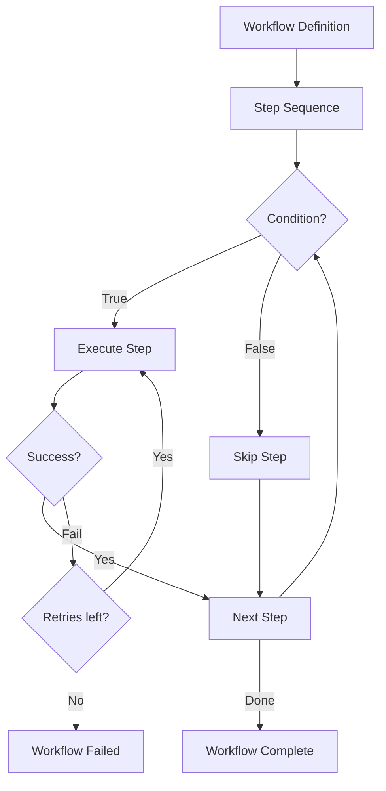

**Built-in Templates**:
- `etl`, Extract → Transform → Load pipeline
- `ci_cd`, Build → Test → Deploy pipeline
- `data_pipeline`, Fetch → Process → Store pipeline

**Features**:
- Sequential step execution with dependency resolution
- Conditional step execution (skip on condition)
- Configurable retries per step (with delay)
- Context passing between steps (shared state)
- Real-time status tracking
- Workflow persistence (resume after crash)

**Example**:
```python
from opensable.core.workflow import WorkflowEngine, WorkflowStep

engine = WorkflowEngine()

# Define workflow
workflow = engine.create_workflow("deploy_app", steps=[
    WorkflowStep(name="build", action=build_fn, retries=2),
    WorkflowStep(name="test", action=test_fn, condition=lambda ctx: ctx.get("build_ok")),
    WorkflowStep(name="deploy", action=deploy_fn, retries=3, retry_delay=30),
])

# Execute
result = await engine.run(workflow)
print(result.status)  # "completed"
print(result.duration)  # timedelta
```

### Self-Modification Engine, Runtime Evolution

**Safely modify own source code at runtime with full rollback and audit trail.**

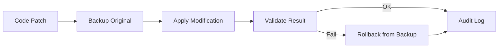

**Safety Features**:
- Automatic backup before every modification
- AST validation of modified code
- Full rollback capability (any modification)
- Complete audit trail (who, what, when, why)
- Configurable allowed paths (sandboxed)

**Example**:
```python
from opensable.core.self_modify import SelfModifier

modifier = SelfModifier(allowed_paths=["opensable/skills/"])

# Apply a modification
result = modifier.modify(
    file_path="opensable/skills/custom_skill.py",
    old_code="return result",
    new_code="return result.strip()",
    reason="Fix trailing whitespace in skill output"
)

# Rollback if needed
modifier.rollback(result.modification_id)

# View audit trail
history = modifier.get_history()
```

### Image Generation, Visual Content Creation

**Generate images, QR codes, and thumbnails using Pillow.**

**Features**:
- Text-to-image with customizable fonts, sizes, colors
- QR code generation (with `qrcode` library)
- Thumbnail creation from existing images
- Gradient backgrounds
- Watermarking

**Example**:
```python
from opensable.core.image_gen import ImageGenerator

gen = ImageGenerator()

# Text banner
gen.create_text_image("Hello World", output="banner.png", font_size=48)

# QR code
gen.create_qr_code("https://opensable.ai", output="qr.png")

# Thumbnail
gen.create_thumbnail("photo.jpg", size=(200, 200), output="thumb.jpg")
```

---

## 🎙️ Voice & Multimodal Features

### Voice Interface Architecture

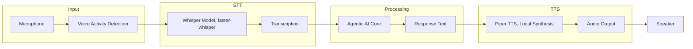

**Features**:
- **Whisper STT**: Local speech recognition (faster-whisper)
- **Piper TTS**: Fast, natural text-to-speech (fully local)
- **VAD**: Voice Activity Detection for efficiency
- **Multiple Voices**: EN/ES, male/female options
- **Conversation Mode**: Continuous voice interaction
- **Audio Streaming**: Real-time processing

**Example**:
```python
from opensable.core.voice_interface import VoiceInterface, WhisperModel, TTSVoice

voice = VoiceInterface(
    whisper_model=WhisperModel.BASE,
    tts_voice=TTSVoice.EN_US_FEMALE
)

# Voice command (end-to-end)
result = await voice.voice_command(
    audio_input="path/to/audio.wav",
    respond_with_voice=True,
    command_handler=your_handler
)

# Result contains:
# - transcription: "What's the weather?"
# - response_text: "It's sunny and 72°F"
# - response_audio: bytes (synthesized speech)
```

### Multimodal Agentic AI

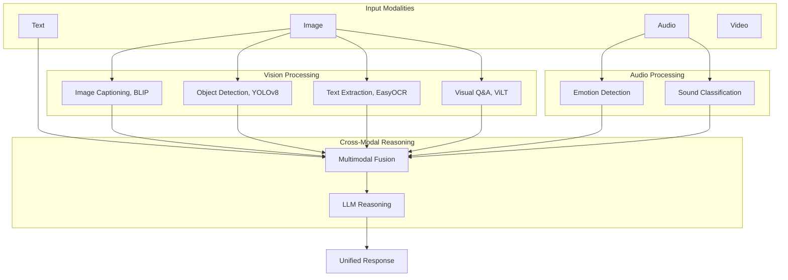

**Vision Capabilities**:
- Image captioning (BLIP)
- Object detection (YOLOv8)
- OCR text extraction (EasyOCR)
- Visual question answering (ViLT)
- Scene understanding
- Face detection

**Audio Capabilities**:
- Emotion detection in speech
- Sound classification
- Music analysis
- Speaker identification

**Example**:
```python
from opensable.core.multimodal_agi import MultimodalAGI, MultimodalInput, VisionTask

agi = MultimodalAGI(device="cpu")

# Analyze image
caption = await agi.vision.analyze_image("image.jpg", VisionTask.IMAGE_CAPTION)
# Result: "A scenic mountain landscape with snow-capped peaks"

# Visual Q&A
answer = await agi.vision.visual_question_answering(
    "image.jpg", 
    "What is in this image?"
)

# Multimodal processing
input_data = MultimodalInput(
    text="Describe what you see and hear",
    image=b"",   # image bytes
    audio=b""    # audio bytes (optional)
)

result = await agi.process_multimodal_input(
    input_data,
    "Analyze the scene comprehensively"
)
```

---

## 📱 Multi-Device Sync

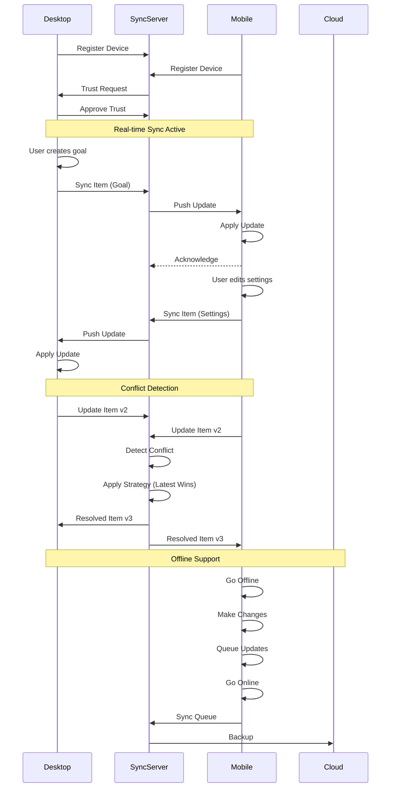

**Features**:
- Real-time WebSocket synchronization
- Offline queue with eventual consistency
- 5 conflict resolution strategies:
  - Latest Wins
  - Server Wins
  - Client Wins
  - Intelligent Merge
  - Manual Resolution
- Device management (register, trust, pair)
- Selective sync (7 scopes: conversations, settings, memory, goals, tools, world model, all)
- Optional E2E encryption

**Example**:
```python
from opensable.core.multi_device_sync import MultiDeviceSync, SyncScope

# Initialize on Desktop
desktop = MultiDeviceSync(device_name="Desktop")

# Initialize on Mobile
mobile = MultiDeviceSync(device_name="Mobile")

# Pair devices
await desktop.register_device("Mobile", "mobile")
await desktop.trust_device(mobile.device_id)

# Sync settings from desktop
await desktop.sync_item(
    scope=SyncScope.SETTINGS,
    item_id="preferences",
    data={'theme': 'dark', 'language': 'en'}
)

# Real-time sync
await desktop.start_real_time_sync("ws://sync-server:8080")
```

---

## 📈 Trading Bot (Multi-Exchange)

Open-Sable includes a built-in multi-exchange trading engine that supports crypto, stocks, commodities, and prediction markets, all accessible through natural language chat.

### Quick Start

```bash
# 1. Install trading dependencies
pip install -r requirements-trading.txt

# 2. Enable trading in .env
TRADING_ENABLED=true
TRADING_PAPER_MODE=true    # Safe paper trading (no real money)

# 3. Start the bot
python main.py
# Open http://127.0.0.1:8789 for the web trading terminal
```

### Supported Exchanges

| Exchange | Asset Types | Status |
|----------|-------------|--------|
| **Paper Trading** | All (simulated) | ✅ Built-in |
| **CoinGecko** | Crypto prices (free) | ✅ No API key needed |
| **Binance** | Crypto spot & futures | ✅ Requires API key |
| **Coinbase** | Crypto spot | ✅ Requires API key |
| **Alpaca** | US stocks & ETFs | ✅ Requires API key |
| **Polymarket** | Prediction markets | ✅ Requires wallet |
| **Hyperliquid** | Crypto perpetuals | ✅ Requires wallet |
| **Jupiter (Solana)** | DeFi / meme coins | ✅ Requires wallet |

### Chat Commands

Just talk naturally, the AI routes to the right trading tool:

```
"What's the price of Bitcoin?"          → Live price from CoinGecko
"Show my portfolio"                     → Portfolio snapshot with P&L
"Buy 0.1 BTC on paper"                 → Paper trade execution
"Analyze ETH/USDT"                     → Technical analysis with signals
"Show risk status"                      → Risk manager limits & status
"Start scanning BTC/USDT,ETH/USDT"     → Background market scanner
"Show trade history"                    → Recent trade log
```

### Trading Tools (10 total)

| Tool | Description |
|------|-------------|
| `trading_price` | Live prices from exchanges or CoinGecko |
| `trading_portfolio` | Portfolio value, positions, P&L |
| `trading_buy` / `trading_sell` | Execute trades (paper or live) |
| `trading_analyze` | Technical analysis with strategy signals |
| `trading_signals` | Scan watchlist for opportunities |
| `trading_history` | Trade history log |
| `trading_risk_status` | Risk limits and current exposure |
| `trading_scanner` | Start/stop background market scanner |
| `trading_set_risk` | Update risk parameters |

### Risk Management

Built-in risk guardrails protect against losses:

- **Max position size**: Default 5% of portfolio per trade
- **Max daily loss**: Default 2%, halts trading if exceeded
- **Max drawdown**: Default 10%, emergency halt
- **Max open positions**: Default 10
- **Approval gate**: Trades above $100 require confirmation (HITL)
- **Banned assets**: Configurable block list

### Strategies

| Strategy | Description |
|----------|-------------|
| Momentum | RSI, MACD, volume breakout detection |
| Mean Reversion | Bollinger Bands, z-score, RSI oversold/overbought |
| Sentiment | News & social sentiment analysis |
| Arbitrage | Cross-exchange price differential detection |
| Polymarket Edge | Prediction market mispricing |

### Going Live (Real Money)

> ⚠️ **WARNING**: Real trading involves financial risk. Start with paper mode.

```bash
# In .env, switch to live trading
TRADING_PAPER_MODE=false
BINANCE_API_KEY=your_key
BINANCE_API_SECRET=your_secret
TRADING_REQUIRE_APPROVAL_ABOVE_USD=50    # Low threshold for safety
TRADING_MAX_ORDER_USD=100                # Small position limit
```

See [docs/TRADING_GUIDE.md](docs/TRADING_GUIDE.md) for the full trading documentation.

---

## 🧩 Skills System + Community Skills

### SKILL.md Format

Open-Sable uses a portable, cross-platform skill definition using SKILL.md files with YAML frontmatter:

```markdown
---
name: Web Search
version: 1.0.0
description: Search the web using DuckDuckGo
author: SableCore
tags: [search, web, duckduckgo]
triggers: [search, google, look up, find]
dependencies: [requests]
---

# Web Search

Search the web and return results.

## Usage
`/skill web_search query="OpenAI GPT-4"`
```

### 16 Community Skills (real, functional)

| Skill | Description | API |
|-------|-------------|-----|
| 🔍 Web Search | DuckDuckGo web search | DuckDuckGo API |
| 🌤️ Weather Checker | Real-time weather data | Open-Meteo API |
| 🧮 Smart Calculator | Math expressions + unit conversion | Built-in |
| 📁 File Manager | Read, write, list, search files | Built-in |
| 💻 System Info | CPU, memory, disk, network stats | psutil |
| ⏰ Reminder Manager | Create, list, check reminders | Built-in |
| 📝 Note Taker | CRUD notes with search | Built-in |
| ▶️ Code Runner | Sandboxed Python/JS execution | subprocess |
| 🌐 API Caller | Generic REST API client | requests |
| 📋 Text Summarizer | Extractive text summarization | Built-in |
| 🌍 Translator | Multi-language translation | MyMemory API |
| 🔧 JSON Toolkit | Parse, format, query JSON | Built-in |
| 📦 Git Helper | Status, log, diff, branch info | git CLI |
| ✅ Task Tracker | TODO list management | Built-in |
| 🔑 Password Generator | Secure password generation | secrets |
| 🔤 Regex Helper | Pattern matching + explanation | re |

### 5 Built-in SableCore Skills

Additional skills integrated directly into the core agent for common operations.

### SkillFactory

The SkillFactory can **autonomously create new skills** from natural language descriptions. Created skills are automatically packaged in SKILL.md format and published to the Skills Hub.

### Skills Hub

Central registry for discovering, installing, rating, and managing skills:

```python
from opensable.core.skills_hub import SkillsHub

hub = SkillsHub()

# Search skills
results = hub.search("weather")

# Install from catalog
hub.install_skill("path/to/SKILL.md")

# Rate a skill
hub.rate_skill("web_search", 5, "Excellent results!")

# List all installed
for skill in hub.list_installed():
    print(f"{skill.name} v{skill.version}, ⭐{skill.rating}")
```

---

## 🚀 Complete Workflow Example

Here's how all systems work together:

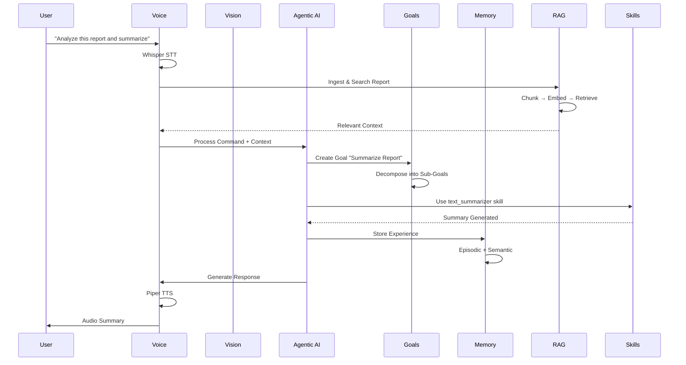

**Python Example**:
```python
from opensable.core.agi_integration import AGIAgent
from opensable.core.voice_interface import VoiceInterface
from opensable.core.rag import RAGEngine
from opensable.core.skills_hub import SkillsHub

# Initialize all components
agi = AGIAgent()
voice = VoiceInterface()
rag = RAGEngine()
skills = SkillsHub()

# Voice command handler
async def handle_command(text: str) -> str:
    if "analyze" in text.lower():
        # RAG search
        context = await rag.search(text, top_k=5)
        
        # Create goal
        goal = await agi.set_goal(
            description=f"Analyze and respond: {text}",
            success_criteria=["Analysis complete", "Response generated"],
            auto_execute=True
        )
        
        return f"Analysis complete. {context[0].text}"
    
    return f"I heard: {text}"

# Process voice command
result = await voice.voice_command(
    "audio.wav",
    respond_with_voice=True,
    command_handler=handle_command
)
```

---

## 📦 Installation & Setup

### Requirements

- **Python 3.11+** (required)
- **8GB+ RAM** (16GB+ recommended for vision/voice features)
- **Ollama** (recommended for local LLM) or API keys for OpenAI/Anthropic

### Step-by-Step Installation

```bash
# 1. Clone the repository
git clone https://github.com/IdeoaLabs/Open-Sable.git
cd Open-Sable

# 2. Create virtual environment (IMPORTANT - avoids conflicts)
python3 -m venv venv
source venv/bin/activate  # Windows: venv\Scripts\activate

# 3. Upgrade pip
pip install --upgrade pip setuptools wheel

# 4. Install Open-Sable
# Core only (minimal - chat bot + basic features):
pip install -e ".[core]"

# Or with voice capabilities:
pip install -e ".[core,voice]"

# Or with vision capabilities:
pip install -e ".[core,vision]"

# Or ALL features:
pip install -e ".[core,voice,vision,automation,database,monitoring]"

# 5. Configure environment
cp .env.example .env
# Edit .env and set your Telegram bot token:
nano .env  # or vim, code, etc.
# Set: TELEGRAM_BOT_TOKEN=your_token_from_botfather

# 6. Install Ollama (local LLM - free & private)
curl -fsSL https://ollama.com/install.sh | sh
ollama pull llama3.1:8b  # or llama3.2:3b for smaller systems

# 7. Start Open-Sable
python -m opensable
# Or: python main.py
```

### Using Cloud LLMs Instead

Don't want to run Ollama locally? Use OpenAI or Anthropic:

```bash
# In .env file, add:
OPENAI_API_KEY=sk-...
# or
ANTHROPIC_API_KEY=sk-ant-...

# Then disable auto-select:
AUTO_SELECT_MODEL=false
```

### Docker Deployment

```bash
# Quick start with Docker Compose
docker-compose up -d

# View logs
docker-compose logs -f opensable

# Stop
docker-compose down
```

### Kubernetes Deployment

```bash
# Apply all manifests
kubectl apply -f k8s/

# Check status
kubectl get pods -n opensable

# View logs
kubectl logs -f deployment/opensable -n opensable
```

### Troubleshooting

**Issue**: `ModuleNotFoundError: No module named 'opensable'`
- **Solution**: Make sure you activated the venv: `source venv/bin/activate`

**Issue**: `error: externally-managed-environment`
- **Solution**: Use a virtual environment (step 2 above)

**Issue**: Ollama connection refused
- **Solution**: Start Ollama: `ollama serve` or check `OLLAMA_BASE_URL` in `.env`

**Issue**: No response from bot
- **Solution**: Check `TELEGRAM_BOT_TOKEN` is correct in `.env`, verify bot with @BotFather

---

## 🧪 Running Tests

```bash
# Run all core tests (9/9 should pass)
python -m pytest tests/test_features.py -v

# Run full test suite
python -m pytest tests/ -v

# Run specific test
python -m pytest tests/test_features.py::test_skill_factory -v
```

**Test Coverage** (9/9 ✅):

| Test | What it validates |
|------|-------------------|
| `test_file_structure` | All 56 core + 13 interface modules exist |
| `test_skills_hub` | Skills Hub loads 21+ skills, search works |
| `test_pdf_parser` | PDF parsing with graceful fallback |
| `test_advanced_memory` | 10 auto-categories, store & recall |
| `test_discord_bot` | Discord bot module loads correctly |
| `test_telegram_progress` | Telegram progress bar module |
| `test_whatsapp_bridge` | WhatsApp bridge config exists |
| `test_onboarding` | 8-step onboarding wizard |
| `test_skill_factory` | SkillFactory blueprint → generate → validate |

### Running Examples

```bash
# Agentic AI Capabilities
python3 examples/agi_capabilities_example.py

# Autonomous Demo
python3 examples/autonomous_demo.py

# Multimodal Voice
python3 examples/multimodal_voice_example.py

# RAG Pipeline
python3 examples/rag_examples.py

# Workflow Engine
python3 examples/workflow_examples.py
```

---

## ⭐ Star History

<a href="https://star-history.com/#IdeoaLabs/Open-Sable&Date">
  <picture>
    <source media="(prefers-color-scheme: dark)" srcset="https://api.star-history.com/svg?repos=IdeoaLabs/Open-Sable&type=Date&theme=dark" />
    <source media="(prefers-color-scheme: light)" srcset="https://api.star-history.com/svg?repos=IdeoaLabs/Open-Sable&type=Date" />
    
  </picture>
</a>

---

## 📊 Project Statistics

**Current Version**: 1.3.0

| Component | Files | Lines | Status |
|-----------|-------|-------|--------|
| Core Modules | 65 | 50,000+ | ✅ Complete |
| Agentic AI Systems | 6 | 5,500+ | ✅ Complete |
| Deep Cognition (v1.2) | 6 | 3,100+ | ✅ Complete |
| Autonomous Agency (v1.3) | 3 | 1,400+ | ✅ Complete |
| Phase 3 Engines | 5 | 3,000+ | ✅ Complete |
| Voice & Multimodal | 4 | 3,000+ | 🧪 Experimental |
| Interfaces | 13 | 7,000+ | ✅ Complete |
| Skills (4 categories) | 25 | 4,500+ | ✅ Complete |
| Examples | 16 | 3,000+ | ✅ Complete |
| Tests | 18 | 5,000+ | ✅ 518 Passing |
| Documentation | 10 | 2,000+ | ✅ Complete |
| Kubernetes | 7 | 500+ | 📝 Templates |
| **Total** | **194** | **90,000+** | **✅ Core Complete** |

### Module Inventory (65 Core Modules)

**Agentic AI Core** (6):
`goal_system` · `advanced_memory` · `meta_learning` · `tool_synthesis` · `world_model` · `metacognition`

**Deep Cognition** (6):
`cognitive_memory` · `self_reflection` · `skill_evolution` · `git_brain` · `inner_life` · `pattern_learner`

**Autonomous Agency** (3):
`proactive_reasoning` · `react_executor` · `github_skill`

**Phase 3 Engines** (5):
`skill_factory` · `rag` · `workflow` · `self_modify` · `image_gen`

**Agent Infrastructure** (8):
`agent` · `config` · `llm` · `commands` · `sessions` · `session_manager` · `context_manager` · `plugins`

**Skills & Marketplace** (4):
`skills_hub` · `skills_marketplace` · `skill_creator` · `skill_factory`

**Enterprise & Security** (5):
`enterprise` · `security` · `rate_limiter` · `sandbox_runner` · `gateway`

**Observability** (4):
`monitoring` · `observability` · `analytics` · `heartbeat`

**Voice & Multimodal** (4):
`voice_interface` · `voice` · `voice_handler` · `multimodal_agi`

**Communication** (3):
`multi_messenger` · `multi_device_sync` · `mobile_relay`

**AI & Autonomy** (5):
`advanced_ai` · `agi_integration` · `autonomous_mode` · `multi_agent` · `computer_tools`

**Data & Storage** (5):
`memory` · `cache` · `task_queue` · `workflow_persistence` · `pdf_parser`

**Utilities** (7):
`onboarding` · `nodes` · `interface_sdk` · `image_analyzer` · `system_detector` · `webhooks` · `tools`

### Interface Inventory (13 Platforms)

`telegram_bot` · `telegram_userbot` · `telegram_progress` · `discord_bot` · `whatsapp_bot` · `slack_bot` · `matrix_bot` · `irc_bot` · `email_bot` · `cli_interface` · `mobile_api` · `voice_call`

---

## 🏗️ Tech Stack

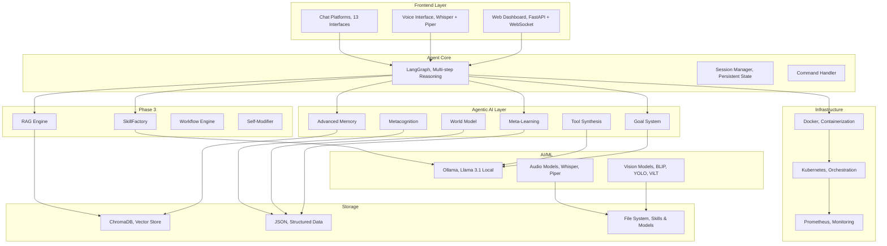

**Core Technologies**:
- **Agent**: LangGraph, LangChain
- **LLM**: Ollama (Llama 3.1), fully local
- **Memory**: ChromaDB (vector) + Advanced multi-layer system
- **Agentic AI**: Custom implementations (5,500+ lines)
- **RAG**: ChromaDB + sentence chunking + PDF/TXT/MD ingestion
- **Voice**: faster-whisper (STT), Piper (TTS)
- **Vision**: BLIP, CLIP, YOLOv8, EasyOCR, ViLT
- **Skills**: SKILL.md format + SkillFactory (autonomous creation)
- **Automation**: Playwright (browser), smtplib (email)
- **Security**: Docker sandbox + permission system + JWT/RBAC
- **Deployment**: Docker, Kubernetes, Prometheus

---

## 🔧 Configuration

### Environment Variables

```bash
# Core
TELEGRAM_BOT_TOKEN=your_token
LLM_ENDPOINT=http://localhost:11434
LOG_LEVEL=INFO

# Agentic AI Configuration
AGI_STORAGE_DIR=./data/agi
AGI_MEMORY_CONSOLIDATION_INTERVAL=1  # hours
AGI_META_LEARNING_INTERVAL=24  # hours
AGI_MAX_EPISODIC_MEMORIES=10000
AGI_MAX_SEMANTIC_MEMORIES=50000
AGI_WORKING_MEMORY_CAPACITY=7
AGI_TOOL_SYNTHESIS_ENABLED=true
AGI_TOOL_SAFETY_STRICT=true

# Voice Configuration
VOICE_STT_MODEL=base  # tiny, base, small, medium, large
VOICE_TTS_VOICE=en_US-lessac-medium
VOICE_DEVICE=cpu  # cpu or cuda

# Multimodal Configuration
VISION_DEVICE=cpu
VISION_CACHE_DIR=./models/vision
AUDIO_CACHE_DIR=./models/audio

# Sync Configuration
SYNC_SERVER_URL=ws://localhost:8080
SYNC_ENABLE_ENCRYPTION=false
SYNC_CONFLICT_STRATEGY=latest_wins

# Skills
SKILLS_DIR=./skills
SKILL_FACTORY_ENABLED=true

# RAG
RAG_COLLECTION=sablecore_docs
RAG_CHUNK_SIZE=500
RAG_CHUNK_OVERLAP=50

# Enterprise
ENTERPRISE_MULTI_TENANT=false
ENTERPRISE_SSO_ENABLED=false
```

---

## 📚 API Reference

### Agentic AI Agent

```python
from opensable.core.agi_integration import AGIAgent

agent = AGIAgent(
    llm_function=your_llm,
    action_executor=your_executor,
    storage_dir=Path("./data/agi")
)

# Set goal
result = await agent.set_goal(
    description="Task description",
    success_criteria=["criterion1", "criterion2"],
    priority=GoalPriority.HIGH,
    auto_execute=True
)

# Create tool
tool_id = await agent.create_tool_for_task(
    task_description="What the tool does",
    expected_inputs=[...],
    expected_outputs=[...]
)

# Predict future
prediction = await agent.predict_and_plan(
    scenario="Scenario description",
    time_horizon=60  # minutes
)

# Self-improve
improvement = await agent.self_improve()

# Get status
status = agent.get_status()

# Autonomous operation
await agent.start_autonomous_operation(
    improvement_interval_hours=24
)
```

### Voice Interface

```python
from opensable.core.voice_interface import VoiceInterface, WhisperModel, TTSVoice

voice = VoiceInterface(
    whisper_model=WhisperModel.BASE,
    tts_voice=TTSVoice.EN_US_FEMALE,
    language="en",
    device="cpu"
)

# Transcribe audio
transcription = await voice.stt.transcribe_file("audio.wav")

# Synthesize speech
synthesis = await voice.tts.synthesize(
    text="Hello, how can I help?",
    output_path="output.wav"
)

# Voice command (end-to-end)
result = await voice.voice_command(
    audio_input="audio.wav",
    respond_with_voice=True,
    command_handler=your_handler
)

# Conversation mode
await voice.start_conversation_mode(callback=your_callback)
```

### RAG Engine

```python
from opensable.core.rag import RAGEngine

rag = RAGEngine(collection_name="my_docs")

# Ingest document
doc = await rag.ingest("report.pdf")

# Ingest file
doc = await rag.ingest_file("data.txt", metadata={"source": "manual"})

# Semantic search
results = await rag.search("revenue trends", top_k=5)
for r in results:
    print(f"[{r.score:.2f}] {r.text[:100]}...")

# Full RAG query
answer = await rag.query("Summarize Q3 results", llm_function=your_llm)
```

### Workflow Engine

```python
from opensable.core.workflow import WorkflowEngine, WorkflowStep

engine = WorkflowEngine()

# From template
workflow = engine.from_template("etl", params={
    "source": "api://data",
    "destination": "db://warehouse"
})

# Custom workflow
workflow = engine.create_workflow("my_flow", steps=[
    WorkflowStep(name="fetch", action=fetch_fn),
    WorkflowStep(name="process", action=process_fn, retries=3),
    WorkflowStep(name="store", action=store_fn, condition=lambda ctx: ctx["valid"]),
])

# Execute
result = await engine.run(workflow)
```

### SkillFactory

```python
from opensable.core.skill_factory import SkillFactory

factory = SkillFactory(llm_function=your_llm)

# Create skill from natural language
skill = await factory.create_skill(
    name="price_checker",
    description="Check product prices from Amazon",
    template="api_fetcher"
)

# List available templates
templates = factory.list_templates()
# ['api_fetcher', 'data_processor', 'file_handler', 'automation']
```

### Self-Modifier

```python
from opensable.core.self_modify import SelfModifier

modifier = SelfModifier(allowed_paths=["opensable/skills/"])

# Modify code
result = modifier.modify(
    file_path="opensable/skills/my_skill.py",
    old_code="return data",
    new_code="return data.strip()",
    reason="Fix whitespace issue"
)

# Rollback
modifier.rollback(result.modification_id)

# Audit trail
history = modifier.get_history()
```

### Multi-Device Sync

```python
from opensable.core.multi_device_sync import MultiDeviceSync, SyncScope, SyncStrategy

sync = MultiDeviceSync(
    device_name="Desktop",
    conflict_strategy=SyncStrategy.LATEST_WINS,
    enable_encryption=False
)

# Register & trust device
device_id = await sync.register_device("Mobile", "mobile")
await sync.trust_device(device_id)

# Sync item
await sync.sync_item(
    scope=SyncScope.SETTINGS,
    item_id="preferences",
    data={'theme': 'dark'},
    version=1
)

# Real-time sync
await sync.start_real_time_sync("ws://sync-server:8080")
```

### Skills Marketplace

The [Skills Marketplace](https://skills.opensable.com) is a community-driven store where humans and agents can discover, install, review, and publish skills.

#### Architecture

There are **two independent ways** to connect your agent to the marketplace:

| Method | Auth | Use Case |
|--------|------|----------|
| **Store API Key** (`sk_*`) | `Authorization: Bearer sk_...` | Human-delegated access , agent acts on your behalf |
| **Agent Gateway (SAGP/1.0)** | Ed25519 + AES-256-GCM | Fully autonomous agent-to-agent access |

Most users only need the **Store API Key** method. The SAGP gateway is for advanced deployments where the agent operates fully autonomously with its own cryptographic identity.

#### Method 1: Store API Key (Recommended)

1. **Create an account** at [skills.opensable.com](https://skills.opensable.com)
2. **Copy your API key** from your profile (starts with `sk_`)
3. **Add it to `.env`**:

```env
SABLE_STORE_API_KEY=sk_14a3807e7...
```

4. **Restart the agent** , it auto-configures on startup

The agent can now install skills, search the catalog, and post reviews using your store account:

```python
from opensable.core.skills_marketplace import SkillRegistry, SkillManager, SkillCategory

registry = SkillRegistry()
manager = SkillManager(registry=registry)

# Search the marketplace
skills = await registry.search_skills(
    query="email",
    category=SkillCategory.COMMUNICATION,
    tags=["automation"],
    limit=20
)

# Install a skill (installs to opensable/skills/installed/)
installed = await manager.install_skill("email-assistant", version="1.0.0")

# Update all installed skills
updated = await manager.update_all_skills()
```

You can also use the API key directly with `curl` or any HTTP client:

```bash
# Search skills
curl -H "Authorization: Bearer sk_YOUR_KEY" https://sk.opensable.com/api/skills?q=weather

# Install a skill
curl -X POST -H "Authorization: Bearer sk_YOUR_KEY" https://sk.opensable.com/api/install/weather-checker

# Get your profile
curl -H "Authorization: Bearer sk_YOUR_KEY" https://sk.opensable.com/api/auth/profile
```

The `X-API-Key` header is also supported:

```bash
curl -H "X-API-Key: sk_YOUR_KEY" https://sk.opensable.com/api/skills
```

#### Method 2: Agent Gateway (SAGP/1.0)

For fully autonomous agent operations with cryptographic identity. The agent proves who it is with Ed25519 signatures and all traffic is encrypted with AES-256-GCM.

1. **Provision the agent** (run on the server, one time):

```bash
node marketplace/server/scripts/provision-agent.js --name "My Agent"
```

This prints three values. Add them to `.env`:

```env
SABLE_AGENT_ID=<hex agent id>
SABLE_AGENT_SIGNING_KEY=<base64 Ed25519 secret key>
SABLE_AGENT_ENCRYPTION_KEY=<base64 X25519 secret key>
```

2. **Restart the agent** , it authenticates via the 7-layer SAGP protocol automatically

The SAGP gateway provides:

| Layer | Protection |
|-------|------------|
| 1. Ed25519 | Unforgeable cryptographic identity |
| 2. HMAC-SHA512 | Payload integrity verification |
| 3. Speed Gate | 150ms challenge-response (anti-replay) |
| 4. Agent DNA | Runtime fingerprint (anti-tampering) |
| 5. AES-256-GCM | End-to-end payload encryption |
| 6. Circuit Breaker | Auto-lockout after repeated failures |
| 7. Anomaly Detection | Behavioral trust scoring |

#### Environment Variables Reference

```env
# ── Skills Marketplace ──
SKILLS_REGISTRY_URL=https://sk.opensable.com        # Marketplace server
SKILLS_API_URL=https://sk.opensable.com/api          # REST API base URL
SKILLS_STORE_URL=https://skills.opensable.com        # Web store frontend

# ── Store API Key (recommended , human-delegated access) ──
SABLE_STORE_API_KEY=sk_...                           # From your store profile

# ── Agent Gateway (advanced , autonomous SAGP access) ──
SABLE_GATEWAY_URL=https://sk.opensable.com/gateway   # Gateway endpoint
SABLE_AGENT_ID=                                      # Provisioned agent hex ID
SABLE_AGENT_SIGNING_KEY=                             # Base64 Ed25519 secret
SABLE_AGENT_ENCRYPTION_KEY=                          # Base64 X25519 secret
```

---

## 🎓 Learning & Adaptation

The Agentic AI system learns and improves over time:

### Learning Curve

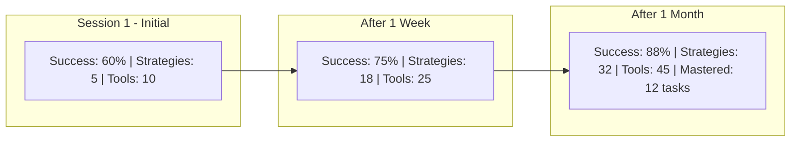

**Metrics**:
- **Success Rate**: Improves from 60% → 88% over 1 month
- **Strategies**: Learns 27 new strategies
- **Tools**: Synthesizes 35 custom tools
- **Task Mastery**: Masters 12 task types

---

## 🔒 Security & Privacy

### Security Features

- **Local-First**: All processing runs locally (privacy-preserving)
- **Sandboxed Execution**: Tools run sandboxed with resource limits; network disabled by default (configurable)
- **Safety Checks**: Blocks dangerous operations (exec, eval, subprocess, system calls)
- **Import Validation**: Whitelist-based import restrictions
- **Resource Limits**: CPU time, memory, file descriptors, process count
- **Enterprise RBAC**: Role-based access control with JWT authentication
- **Multi-Tenancy**: Isolated tenant environments
- **Self-Modification Audit**: Full audit trail for all code changes
- **E2E Encryption**: Optional encryption for multi-device sync (experimental)
- **Audit Logging**: Complete action history

### Current Limitations

- LLM-dependent for reasoning (requires local or remote LLM)
- No vision/multimodal in base install (optional dependencies)
- Limited to Python tool generation
- Memory consolidation requires periodic execution

---

## 🛣️ Roadmap

- [x] Core agent loop
- [x] Basic skills (email, calendar, browser)
- [x] Cognitive subsystems (goals, memory, learning, tool synthesis, world model, metacognition)
- [x] Deep cognition layer (cognitive memory, self-reflection, skill evolution, git brain, inner life, pattern learner)
- [x] Voice interface (experimental)
- [x] Multi-device sync (experimental)
- [x] Multimodal Agentic AI (experimental)
- [x] 13 chat platform interfaces
- [x] SkillFactory (autonomous skill creation)
- [x] RAG pipeline (document ingestion & retrieval)
- [x] Workflow engine (multi-step automation)
- [x] Self-modification engine (with rollback)
- [x] SKILL.md skill format support
- [x] 16 real community skills (DuckDuckGo, Open-Meteo, MyMemory)
- [x] Enterprise features (RBAC, SSO, multi-tenancy)
- [x] Skills marketplace (public registry)
- [ ] Mobile app (Expo + React Native)
- [x] Neural tool synthesis (pattern-match + AST compose + optional LLM refinement)
- [x] Distributed Agentic AI (multi-agent coordination with network node delegation)
- [x] Emotional intelligence layer (lexicon + pattern + emoji detection, state tracking, response adaptation)
- [x] Cross-platform tool synthesis (Python, JavaScript, Rust code generation)
- [x] Web dashboard (with token auth + rate limiting)

---

## ☁️ Cloud LLM Providers

Open-Sable supports **12 cloud LLM providers** out of the box. If Ollama is not available (or you prefer cloud models), the agent automatically falls back through configured providers until one succeeds.

| Provider | Env Variable | Default Model | Protocol |
|---|---|---|---|
| **OpenAI** | `OPENAI_API_KEY` | `gpt-4o-mini` | OpenAI SDK |
| **Anthropic** | `ANTHROPIC_API_KEY` | `claude-sonnet-4-20250514` | Native SDK |
| **Gemini (Google)** | `GEMINI_API_KEY` | `gemini-2.5-flash` | Native SDK (`google-genai`) |
| **OpenRouter** | `OPENROUTER_API_KEY` | `openai/gpt-4o-mini` | OpenAI-compatible |
| **DeepSeek** | `DEEPSEEK_API_KEY` | `deepseek-chat` | OpenAI-compatible |
| **Groq** | `GROQ_API_KEY` | `llama-3.3-70b-versatile` | OpenAI-compatible |
| **Together AI** | `TOGETHER_API_KEY` | `meta-llama/Llama-3.3-70B-Instruct-Turbo` | OpenAI-compatible |
| **xAI (Grok)** | `XAI_API_KEY` | `grok-3-mini` | OpenAI-compatible |
| **Mistral** | `MISTRAL_API_KEY` | `mistral-small-latest` | OpenAI-compatible |
| **Cohere** | `COHERE_API_KEY` | `command-r-plus` | Native SDK |
| **Kimi (Moonshot)** | `KIMI_API_KEY` | `moonshot-v1-8k` | OpenAI-compatible |
| **Qwen (DashScope)** | `QWEN_API_KEY` | `qwen-turbo` | OpenAI-compatible |

### How it works

1. **Local first**: The agent always tries Ollama at `OLLAMA_BASE_URL` first.
2. **Cloud fallback**: If Ollama is unavailable, it walks through the list above in order, skipping any provider whose API key is empty.
3. **One key is enough**: You only need to set a single provider's API key, the agent will find it and use it.
4. **Tool calling**: All 12 providers support tool/function calling. The agent automatically converts tool schemas into each provider's native format.
5. **Override the model**: Set `DEFAULT_MODEL` in `.env` to use a specific model name instead of the provider's default.

```bash
# Example: use Gemini
GEMINI_API_KEY=AIzaSy...

# Example: use OpenRouter with a custom model
OPENROUTER_API_KEY=sk-or-v1-...
DEFAULT_MODEL=anthropic/claude-sonnet-4-20250514

# Example: use Groq for fast inference
GROQ_API_KEY=gsk_...
```

---

## �️ Productivity & System Tools

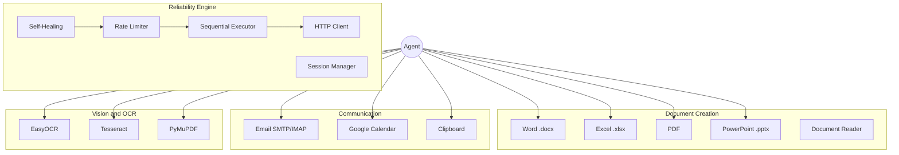

### Document Creation Suite (Cross-Platform)
Full office document creation using pure Python libraries, no LibreOffice or OpenOffice required. Works identically on **Windows, macOS, and Linux**.

- **Word (.docx)**: Create documents with titles, paragraphs, and tables (`python-docx`)
- **Excel (.xlsx)**: Spreadsheets with multiple sheets, headers, auto-width columns, styled headers (`openpyxl`)
- **PDF**: Professional PDFs with titles, body text, styled tables, page layouts (`reportlab`)
- **PowerPoint (.pptx)**: Presentations with title slides, bullet points, content slides, embedded images (`python-pptx`)
- **Document Reader**: Extract text from existing .docx, .xlsx, .pdf, .pptx files
- **Open Document**: Launch any file with the system's default application (xdg-open / open / start)

### Email Integration (SMTP/IMAP)
Send and receive real emails, fully wired to the LLM via tool schemas.

- **Send emails** with subject, body, CC, and file attachments via SMTP
- **Read emails** from any IMAP mailbox (inbox, folders, unread filter)
- **Body preview**: Email reading includes a snippet of the message body
- Configure via `.env`: `SMTP_HOST`, `SMTP_USER`, `SMTP_PASSWORD`, `IMAP_HOST`

### Google Calendar Integration
Calendar tools support both local JSON storage and Google Calendar API.

- **List events**: Upcoming events from Google Calendar (falls back to local store)
- **Add events**: Create events with title, date, duration, location, description
- **Delete events**: Remove by event ID
- Auto-detects Google Calendar credentials; uses local calendar if not configured

### Clipboard / Pasteboard (Cross-Platform)
Read from and write to the system clipboard on any OS.

- **Copy**: Store text in the system clipboard
- **Paste**: Read current clipboard contents
- Backends: `pyperclip` (preferred), native commands (`pbcopy`/`pbpaste`, `xclip`/`xsel`, `wl-copy`, `clip.exe`)

### OCR, Scanned Document Recognition
Extract text from images and scanned PDFs using multiple OCR engines.

- **EasyOCR**: Best accuracy, GPU-accelerated, multi-language
- **Tesseract**: Lightweight, broadly available
- **PyMuPDF**: PDF text extraction + fallback OCR for scanned pages
- Supports `.png`, `.jpg`, `.tiff`, `.bmp`, `.webp`, `.pdf`
- Confidence scoring and per-page extraction

### Autonomous Self-Healing System
The agent monitors its own API interactions and takes corrective action automatically, no human intervention required.

- **Pattern detection**: Recognizes rate limits (429), access restrictions (226), search failures (404), auth errors, and general exceptions
- **Grok-assisted diagnosis**: On unrecognized errors, consults Grok AI for root-cause analysis, then **executes the recommended fix** (not just logs it)
- **Concrete auto-repair actions**: Pause loops, reduce activity by 50%, disable problematic features, rotate User-Agent, increase cooldowns, chosen based on Grok's analysis
- **Safe fallback**: If no specific action can be parsed, applies a conservative 10-minute pause
- **Operator alerts**: Critical errors trigger Telegram notifications with deduplication (max 1 alert per error type every 5 minutes)

### Adaptive Rate-Limiting Queue
All outbound social-media API calls are routed through a centralized **FIFO queue** with self-tuning rate limits.

- **Three risk tiers** (passive/active/aggressive) that self-tune based on API response patterns, cooldowns shrink 5% on success, increase 60–80% on errors
- **Configurable defaults**: 3s / 5s / 10s base cooldowns with 1.5s floor and 120s ceiling
- **Persistent timings**: Learned values are saved to disk and restored on restart
- **Human-like jitter**: ±20% randomized delay on every call
- **Single-flight guarantee**: All platform interactions (posts, likes, replies, AI content generation) flow through the same sequential pipeline

### Browser Session Management (WhatsApp)
The WhatsApp bridge (wwebjs/Puppeteer) intelligently manages its browser lifecycle:

- **Stale process cleanup**: On startup, detects and terminates orphaned Chromium and Node.js processes
- **Lock file recovery**: Removes stale `SingletonLock` files that block browser launch
- **Port conflict resolution**: Frees occupied ports before starting
- **Self-message filtering**: Own messages are dropped at the bridge level, the agent never processes messages it sent itself
- **Graceful shutdown**: Clean stop with timeout→force-kill→cleanup

### HTTP Client Compatibility
The networking layer supports `curl_cffi` as a transport backend, providing broader compatibility with platforms that enforce strict client-validation policies. When available, it is used automatically; otherwise the system falls back to `httpx`.

### Sequential Execution Architecture
The tool execution pipeline enforces strict sequential ordering for all platform-facing operations. Even when the LLM requests multiple tools simultaneously, platform-related tools are serialized to ensure only one API call is in-flight at any time.

---

## 🤝 Contributing

Open-Sable is built in the open. Contributions welcome!

1. Fork the repository
2. Create feature branch (`git checkout -b feature/amazing-feature`)
3. Commit changes (`git commit -m 'Add amazing feature'`)
4. Push to branch (`git push origin feature/amazing-feature`)
5. Open Pull Request

See [CONTRIBUTING.md](CONTRIBUTING.md) for details.

---

## 🚨 Crypto & Token Disclaimer

> **As of today, Open-Sable is NOT associated with any cryptocurrency, token, memecoin, or blockchain project.**

- There is currently **no** "$SABLE" token, no ICO, no presale, no airdrop.
- This is an **open-source AI software project** licensed under MIT.
- If Open-Sable ever launches an official token or partnership, the contract address (CA) and details will be announced **exclusively** on the official website ([opensable.com](https://opensable.com)) and this GitHub repository.
- Anyone promoting a token that is not announced through our official channels is acting independently and is **not affiliated** with this project.
- The built-in trading module is a software tool, it does NOT issue tokens and is NOT a financial service.

*This notice is informational only and does not constitute financial advice. Always DYOR.*

**If you encounter a scam using our name, please [report it here](https://github.com/IdeoaLabs/Open-Sable/issues).**

---

## 📄 License

MIT License, Use it, fork it, make it yours.

See [LICENSE](LICENSE) for full details.

---

## 🙏 Acknowledgments

- **LangGraph**: Multi-step reasoning framework
- **Ollama**: Local LLM runtime
- **Whisper**: Speech recognition
- **Piper**: Text-to-speech
- **BLIP, YOLO, ViLT**: Vision models
- **ChromaDB**: Vector storage

---

## Support

- **Documentation**: [Full docs](docs/)
- **Examples**: [examples/](examples/)

---

**Built with ❤️ as the agent framework that actually works. Autonomous, intelligent, secure and truly useful.**

