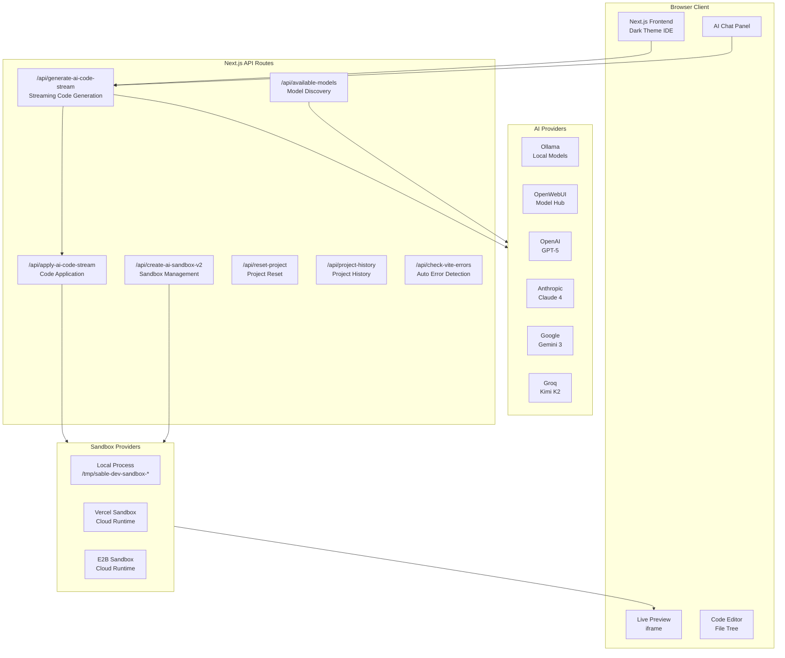
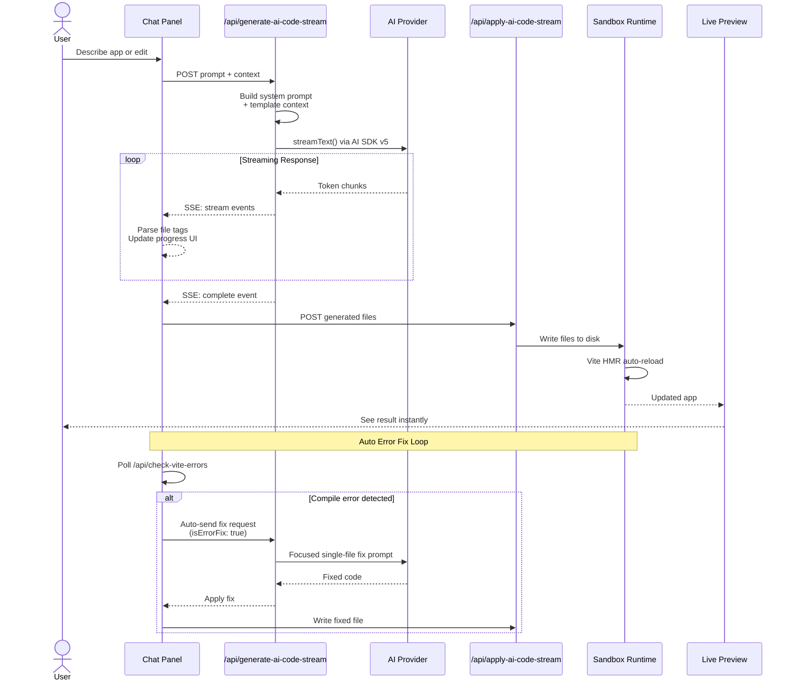
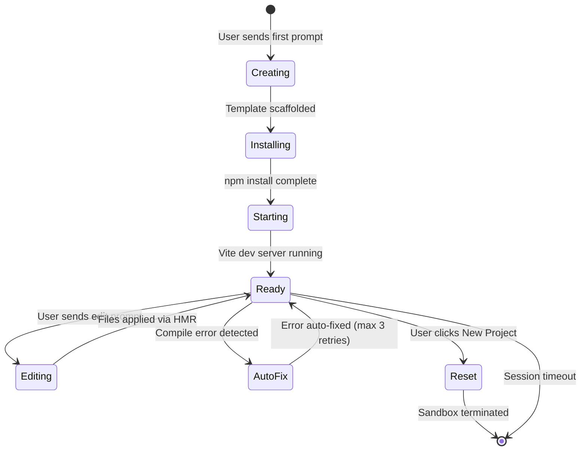
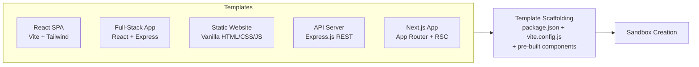
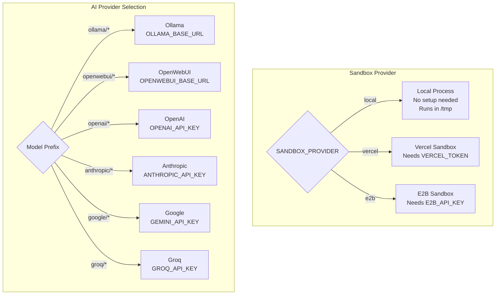

# Sable Dev

**AI-powered application builder by MaliosDark.** Describe what you want, and Sable Dev generates, deploys, and iterates on full-stack applications in real-time, powered by local or cloud LLMs.

Part of the **SableCore** ecosystem. Runs as a standalone dev tool or embedded inside the Sable Desktop app.

---

## Architecture Overview



## Code Generation Flow



## Sandbox Lifecycle



## Project Templates



---

## Features

| Feature | Description |
|---|---|
| **Multi-Provider AI** | Ollama (local), OpenWebUI, OpenAI, Anthropic, Google, Groq |
| **AI SDK v5** | Uses `streamText()` with `.chat()` for OpenAI-compatible providers |
| **Live Preview** | Instant feedback via Vite HMR in sandboxed iframe |
| **Local Sandbox** | No cloud required, runs Vite in `/tmp` with full npm support |
| **Cloud Sandbox** | Optional Vercel or E2B sandbox providers |
| **Auto Error Fix** | Detects Vite compile errors and auto-sends fix requests (up to 3 retries) |
| **Auto Continue** | Detects incomplete generation and auto-requests remaining files |
| **Pre-built Templates** | React SPA comes with Header, Hero, Features, Footer, AI modifies instead of generating from scratch |
| **5 Templates** | React SPA, Full-Stack (React + Express), Static Site, Node API, Next.js |
| **Project History** | Save/restore projects, New Project resets all state |
| **Edit Mode** | Targeted file edits with context-aware prompts |
| **Code Recovery** | Extracts code from markdown fences if LLM doesn't use file tags |
| **Dark Theme** | Full dark IDE interface |
| **Persistence** | Chat history and session state saved to `.sable-dev/` |
| **Desktop Integration** | Embeddable inside the Sable Desktop Electron app |

---

## Setup

Sable Dev is part of the SableCore monorepo. It lives in the `sable_dev/` directory.

### Prerequisites

- **Node.js** >= 18
- **pnpm** (recommended) or npm
- At least one AI provider configured

### 1. Install

```bash
cd sable_dev
pnpm install
```

### 2. Configure Environment

Create `.env.local` in the `sable_dev/` directory:

```env
# ──────────────────────────────────────────────
# SANDBOX PROVIDER (required)
# ──────────────────────────────────────────────
SANDBOX_PROVIDER=local          # 'local' | 'vercel' | 'e2b'

# ──────────────────────────────────────────────
# AI PROVIDERS, configure at least one
# ──────────────────────────────────────────────

# Local AI (Ollama), no API key needed
OLLAMA_BASE_URL=http://localhost:11434

# OpenWebUI (optional)
OPENWEBUI_BASE_URL=https://your-openwebui-instance.com
OPENWEBUI_API_KEY=sk-your-openwebui-key

# Cloud providers (optional)
OPENAI_API_KEY=your_openai_key
ANTHROPIC_API_KEY=your_anthropic_key
GEMINI_API_KEY=your_gemini_key
GROQ_API_KEY=your_groq_key

# ──────────────────────────────────────────────
# OPTIONAL
# ──────────────────────────────────────────────
MORPH_API_KEY=your_morph_key           # Fast apply for edits

# Vercel Sandbox (if SANDBOX_PROVIDER=vercel)
# VERCEL_TOKEN=your_vercel_token
# VERCEL_TEAM_ID=team_xxx
# VERCEL_PROJECT_ID=prj_xxx

# E2B Sandbox (if SANDBOX_PROVIDER=e2b)
# E2B_API_KEY=your_e2b_key
```

### 3. Run

```bash
pnpm dev
```

Opens on **http://localhost:5700**.

Or start via the SableCore main launcher:

```bash
# From the SableCore root
./start.sh --all
```

---

## Provider Configuration



### Local AI Setup (Ollama)

For fully offline operation:

```bash
# Install Ollama
curl -fsSL https://ollama.com/install.sh | sh

# Pull a code-capable model
ollama pull qwen2.5:14b-instruct-q4_K_M

# Sable Dev auto-discovers Ollama models at startup
```

---

## Auto Error Fix & Auto Continue

Sable Dev includes two self-healing mechanisms that run automatically after code generation:

### Auto Error Fix
After applying generated code, the frontend polls `/api/check-vite-errors` to detect compile errors captured from Vite's stderr. If an error is found, it automatically sends a focused fix request to the AI with:
- The exact error message from the Vite compiler
- The content of the broken file
- A laser-focused system prompt for single-file fixes (skips the full agentic workflow)

This loop retries up to **3 times** before stopping and showing the error to the user.

### Auto Continue
When the first generation is incomplete (e.g., the AI ran out of tokens mid-generation), the system detects missing component files and automatically requests the remaining files in a follow-up generation pass.

---

## Project Structure

```
sable_dev/
├── app/
│   ├── layout.tsx                    # Root layout + metadata
│   ├── page.tsx                      # Landing page
│   ├── generation/page.tsx           # Main IDE interface (builder + chat)
│   └── api/
│       ├── generate-ai-code-stream/  # Core: streaming code generation
│       ├── apply-ai-code-stream/     # Writes generated files to sandbox
│       ├── create-ai-sandbox-v2/     # Sandbox provisioning
│       ├── available-models/         # Model discovery (static + Ollama + OpenWebUI)
│       ├── check-vite-errors/        # Auto error detection endpoint
│       ├── get-sandbox-files/        # File tree from sandbox
│       ├── reset-project/            # Full project reset
│       ├── project-history/          # Project history CRUD
│       ├── detect-and-install-packages/ # Auto npm install
│       ├── sandbox-status/           # Sandbox health check
│       ├── sandbox-logs/             # Sandbox log retrieval
│       ├── restart-vite/             # Restart Vite dev server
│       └── ...
├── components/
│   ├── HMRErrorDetector.tsx          # Runtime HMR error detection
│   ├── SandboxPreview.tsx            # Live preview iframe
│   ├── CodeApplicationProgress.tsx   # Code apply progress UI
│   ├── HeroInput.tsx                 # Landing page input
│   └── ui/                           # Reusable UI components (shadcn)
├── lib/
│   ├── sandbox/
│   │   ├── providers/
│   │   │   ├── local-provider.ts     # Local process sandbox (captures Vite errors)
│   │   │   ├── vercel-provider.ts    # Vercel sandbox
│   │   │   └── e2b-provider.ts       # E2B sandbox
│   │   ├── templates/index.ts        # 5 project templates
│   │   ├── factory.ts                # Sandbox provider factory
│   │   └── sandbox-manager.ts        # Sandbox lifecycle management
│   ├── ai/                           # AI provider configuration
│   ├── persistence.ts                # Session persistence (.sable-dev/)
│   ├── context-selector.ts           # File selection for edit context
│   ├── edit-intent-analyzer.ts       # Classifies user edit requests
│   ├── file-parser.ts                # Component tree analysis
│   ├── build-validator.ts            # Build validation utilities
│   └── morph-fast-apply.ts           # Morph fast apply integration
├── config/
│   └── app.config.ts                 # All configurable settings
├── .sable-dev/                       # Auto-created, gitignored
│   ├── session.json                  # Persisted session state
│   ├── chat-history.json             # Chat message history
│   └── project-history.json          # Saved project entries
└── .env.local                        # Your configuration (not committed)
```

---

## Key Technical Details

### AI SDK v5 Compatibility

Sable Dev uses `@ai-sdk/openai` v2.x which defaults to the OpenAI **Responses API** (`/v1/responses`). Since Ollama and OpenWebUI only support the **Chat Completions API** (`/v1/chat/completions`), the code uses `provider.chat(modelId)` instead of `provider(modelId)` for these providers.

### Template-First Generation

The default React SPA template ships with pre-built components (Header, Hero, Features, Footer) using Tailwind CSS. When a user describes an app, the AI **modifies the existing template** rather than generating everything from scratch. This dramatically improves output quality and reduces errors.

### Code Output Format

The LLM is instructed to output **only** XML file tags:

```xml
<file path="src/App.jsx">
import React from 'react';
export default function App() {
  return <div className="text-white">Hello World</div>;
}
</file>
```

If the LLM fails to use file tags, a recovery mechanism attempts to extract code from markdown fences or raw output.

### Error Fix Fast Path

When auto-error-fix triggers, the backend receives an `isErrorFix: true` flag. This activates a focused code path that:
- Replaces the full system prompt with a minimal single-file-fix prompt
- Skips the agentic search workflow
- Injects the broken file content and exact compiler error
- Produces faster, more accurate fixes

### Persistence

Session state is automatically saved to `.sable-dev/` (gitignored):
- Chat history survives page refreshes
- Project history allows switching between projects
- New Project button saves current work before resetting

---

## License

MIT